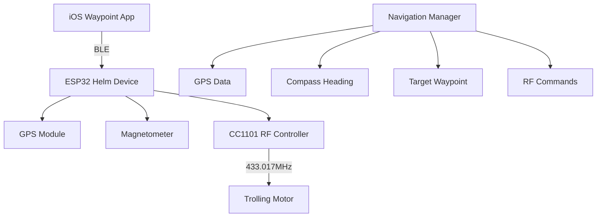

# AutoHelm - GPS Navigation System

AutoHelm is a comprehensive navigation system designed for autonomous GPS-guided navigation with user control of electric boat motors. The system provides compass-guided navigation with real-time GPS tracking, and wireless waypoint management through a companion iOS app.

## Key Features

- **Autonomous GPS Navigation**: Real-time waypoint guidance with compass bearing calculations
- **Helm Navigation Control**: GPS-guided motor control with safety validation and auto-disable features
- **Compass Calibration System**: Magnetometer calibration with live data streaming
- **Bluetooth Low Energy**: Wireless communication with iOS companion app
- **RF Motor Control**: 433MHz wireless control for compatible trolling motors (Watersnake)
- **Offline Map Support**: Download and store OpenStreetMap tiles for offline navigation
- **Waypoint Management**: Create, edit, and manage waypoints with photos and custom icons

## Technology Stack

**ESP32 Hardware:**
- ESP32 DevKit (WROOM-32 or similar)
- U-blox NEO-6M Compatible GPS Module
- PiicoDev Magnetometer MMC5603 (I2C)
- CC1101 433MHz RF Transceiver Module

**iOS App:**
- Swift 5.0
- SwiftUI framework
- MapKit for mapping functionality
- Core Location for GPS services
- Core Bluetooth for BLE communication
- iOS 18.5+ deployment target

## Architecture

### System Design



### Component Interactions

- **GPS Manager**: Handles GPS module communication and NMEA parsing
- **Compass Manager**: Manages magnetometer readings and calibration procedures
- **Navigation Manager**: Core navigation logic, bearing calculations, and heading corrections
- **RF Controller**: CC1101 433MHz radio communication for motor control using RMT peripheral
- **BLE Manager**: Bluetooth communication with iOS app for waypoint transmission

### Data Flow

1. GPS module provides current position and satellite information via UART
2. Magnetometer provides compass heading with calibration corrections via I2C
3. iOS app transmits target waypoints via Bluetooth Low Energy
4. Navigation Manager calculates bearing and distance to target
5. System sends RF commands via CC1101 for course corrections
6. Real-time status transmitted back to iOS app

## Prerequisites

### Hardware Requirements

**Core Components:**
- ESP32 DevKit (WROOM-32, WROVER, or similar with 4MB+ flash)
- U-blox NEO-6M Compatible GPS Module
- PiicoDev Magnetometer MMC5603 (I2C address 0x30)
- CC1101 433MHz RF Transceiver Module
- RTL-SDR Blog V4 USB Dongle with Dipole Antenna Kit (for testing RF)

**Pin Configuration:**

| Function | GPIO | Notes |
|----------|------|-------|
| CC1101 CS | 5 | SPI Chip Select |
| CC1101 GDO0 | 4 | TX Data (RMT output) |
| CC1101 SCK | 18 | SPI Clock |
| CC1101 MISO | 19 | SPI Data In |
| CC1101 MOSI | 23 | SPI Data Out |
| GPS RX | 16 | UART2 RX (from GPS TX) |
| GPS TX | 17 | UART2 TX (to GPS RX) |
| I2C SDA | 21 | Magnetometer |
| I2C SCL | 22 | Magnetometer |

### Software Requirements

- Arduino IDE 2.0+ with ESP32 board support, or PlatformIO
- Xcode 15.0+ (for iOS app)
- iOS device running iOS 18.5+

### ESP32 Board Setup

1. **Add ESP32 Board Support:**
   - Open Arduino IDE Preferences
   - Add to Additional Board Manager URLs:
     ```
     https://raw.githubusercontent.com/espressif/arduino-esp32/gh-pages/package_esp32_index.json
     ```
   - Open Board Manager and install "esp32 by Espressif Systems"

2. **Select Board:**
   - Board: "ESP32 Dev Module" or your specific variant
   - Upload Speed: 921600
   - Flash Frequency: 80MHz
   - Flash Mode: QIO
   - Partition Scheme: Default 4MB with spiffs

### Required Libraries

```cpp
#include <WiFi.h>               // ESP32 WiFi (for BLE coexistence)
#include <BLEDevice.h>          // ESP32 BLE
#include <BLEServer.h>
#include <BLEUtils.h>
#include <BLE2902.h>
#include <Wire.h>               // I2C
#include <SPI.h>                // SPI for CC1101
#include <driver/rmt.h>         // RMT peripheral for precise timing
#include <esp_pm.h>             // Power management
#include <Adafruit_MMC56x3.h>   // Magnetometer
#include <HardwareSerial.h>     // GPS UART
```

Install via Library Manager:
- Adafruit MMC56x3

## Installation

### Hardware Setup

```
ESP32 DevKit
├── SPI Bus → CC1101 RF Module
│   ├── GPIO 5  → CS
│   ├── GPIO 18 → SCK
│   ├── GPIO 19 → MISO
│   ├── GPIO 23 → MOSI
│   └── GPIO 4  → GDO0 (TX data)
│
├── I2C Bus (GPIO 21 SDA, GPIO 22 SCL)
│   └── MMC5603 Magnetometer (0x30)
│
└── UART2 → GPS Module
    ├── GPIO 16 → GPS TX
    └── GPIO 17 → GPS RX
```

**Power Connections:**
- CC1101: 3.3V only (not 5V tolerant)
- GPS Module: 3.3V or 5V (check module specs)
- Magnetometer: 3.3V
- ESP32: USB or regulated 3.3V supply

### Firmware Installation

1. **Clone Repository:**
   ```bash
   git clone https://github.com/brentonford/AutoHelm.git
   cd AutoHelm/Helm
   ```

2. **Install Required Libraries:**
   - Open Arduino IDE Library Manager
   - Install: Adafruit MMC56x3, U8g2

3. **Upload Firmware:**
   - Select Board: ESP32 Dev Module
   - Select appropriate COM port
   - Upload sketch

### iOS App Installation

1. **Development Setup:**
   ```bash
   cd AutoHelm/Waypoint
   open Waypoint.xcodeproj
   ```

2. **Configure Development Team:**
   - Open project settings
   - Set Development Team in Signing & Capabilities
   - Update Bundle Identifier if needed

3. **Build and Run:**
   - Select target device
   - Build and run (Cmd+R)

## Configuration

### System Constants

```cpp
// Pin Configuration
constexpr uint8_t PIN_CC1101_CS   = 5;
constexpr uint8_t PIN_CC1101_GDO0 = 4;
constexpr uint8_t PIN_CC1101_SCK  = 18;
constexpr uint8_t PIN_CC1101_MISO = 19;
constexpr uint8_t PIN_CC1101_MOSI = 23;
constexpr uint8_t PIN_GPS_RX      = 16;
constexpr uint8_t PIN_GPS_TX      = 17;
constexpr uint8_t PIN_I2C_SDA     = 21;
constexpr uint8_t PIN_I2C_SCL     = 22;

// Navigation
constexpr float HEADING_TOLERANCE       = 15.0f;   // Degrees
constexpr float MIN_CORRECTION_INTERVAL = 2000.0f; // Milliseconds
constexpr float MIN_DISTANCE_METERS     = 5.0f;    // Arrival threshold

// I2C Addresses
constexpr uint8_t ADDR_MAGNETOMETER = 0x30;
```

### RF Configuration (CC1101 at 433.017 MHz)

```cpp
// CC1101 Register Configuration for 2-FSK Manchester
// Frequency: 433.017 MHz
writeReg(CC1101Reg::FREQ2, 0x10);
writeReg(CC1101Reg::FREQ1, 0xA7);
writeReg(CC1101Reg::FREQ0, 0x6C);

// Modulation: 2-FSK, async serial mode
writeReg(CC1101Reg::MDMCFG2, 0x00);
writeReg(CC1101Reg::DEVIATN, 0x40);  // ~25 kHz deviation
writeReg(CC1101Reg::PKTCTRL0, 0x32); // Async serial mode

// Manchester encoding via RMT peripheral
// Bit period: 104µs (two 52µs half-bits)
// Bit 0: LOW then HIGH
// Bit 1: HIGH then LOW
```

### Compass Calibration

Run calibration procedure via iOS app for accurate readings. Default calibration values are stored in CompassCalibration struct.

## RF Protocol (Watersnake Motor)

### Signal Parameters

| Parameter | Value |
|-----------|-------|
| Frequency | 433.017 MHz |
| Modulation | 2-FSK |
| Encoding | Manchester Code (IEEE 802.3) |
| Deviation | ~25 kHz (TX), ~5 kHz (RX) |
| Bit period | 104 µs |
| Packet length | 137 bits |

### Packet Structure

```
| Preamble | Sync Word | Device ID    | Command   |
| 32 bits  | 32 bits   | 48 bits      | 25 bits   |
| 2aaaaaaa | d391d391  | xxxxxxxxxxxx | varies    |
```

**Note:** Device ID is unique per remote. Capture your specific remote's ID using RTL-SDR.

### Button Codes

| Button | Command | Payload Structure |
|--------|---------|-------------------|
| Right | `08696a8` | `2aaaaaaad391d391[DeviceID]08696a8` |
| Left | `0269568` | `2aaaaaaad391d391[DeviceID]0269568` |
| Up | `0469428` | `2aaaaaaad391d391[DeviceID]0469428` |
| Down | `806a5a8` | `2aaaaaaad391d391[DeviceID]806a5a8` |
| Motor | `4068da8` | `2aaaaaaad391d391[DeviceID]4068da8` |
| Momentary | `10693a8` | `2aaaaaaad391d391[DeviceID]10693a8` |
| Release | `00e9590` | `2aaaaaaad391d391[DeviceID]00e9590` |

**Note:** Replace `[DeviceID]` with your captured 48-bit device ID.

## Bluetooth Communication Architecture

### Overview

- ESP32 acts as BLE **Peripheral** (advertises and provides services)
- iPhone acts as **Central** (scans, connects, and interacts with characteristics)

### BLE Service Definition

**Service UUID:** `0000FFE0-0000-1000-8000-00805F9B34FB`
**Device Name:** "Helm"

### Characteristics

| UUID | Properties | Purpose | Format |
|------|------------|---------|--------|
| FFE1 | Write | GPS waypoint data | `$GPS,lat,lon,alt*` |
| FFE2 | Notify | Navigation status | JSON |
| FFE3 | Write | Commands | String |
| FFE4 | Notify | Calibration/responses | JSON |
| FFE5 | Read/Write | Configuration | JSON |

### Commands (FFE3)

```
START_CAL     - Begin compass calibration
STOP_CAL      - End calibration
NAV_ENABLE    - Enable navigation
NAV_DISABLE   - Disable navigation
```

### Status Format (FFE2)

```json
{
    "has_fix": true,
    "satellites": 8,
    "currentLat": -32.940931,
    "currentLon": 151.718029,
    "altitude": 45.2,
    "hdop": 1.2,
    "heading": 127.5,
    "distance": 245.8,
    "bearing": 89.2,
    "targetLat": -32.941234,
    "targetLon": 151.718567
}
```

### ESP32 BLE Implementation

The ESP32 uses its native BLE stack (BLEDevice, BLEServer, BLECharacteristic). The implementation creates a GATT server with the service UUID in the advertising packet for iOS discovery. Server callbacks handle connection state changes and automatically restart advertising on disconnect. Each characteristic is configured with appropriate properties (Write for commands/waypoints, Notify for status/calibration) and notify characteristics include a BLE2902 descriptor for client subscription management.

## Usage

### Basic Operation

1. **Power On System:**
   - ESP32 boots and initializes all peripherals
   - GPS begins acquiring fix

2. **Connect iOS App:**
   - Open Waypoint app
   - Bluetooth scans for "Helm"
   - Tap to connect

3. **Set Waypoint:**
   - Tap map location in iOS app
   - Send to Helm
   - Enable navigation

4. **Navigation Active:**
   - System sends RF commands for course corrections
   - Status updates sent to iOS app via BLE

### Helm Navigation Safety Features

**Enable Conditions:**
- Valid GPS fix with satellites ≥ 4
- Dilution of Precision (DOP) < 5.0
- Target waypoint set
- Bluetooth connection stable

**Auto-Disable Triggers:**
- GPS fix loss
- DOP degradation
- Bluetooth disconnect
- Arrival at destination (within 5 meters)

### Serial Commands (Debug)

| Command | Action |
|---------|--------|
| `R` | Hold right |
| `L` | Hold left |
| `U` | Hold up |
| `D` | Hold down |
| `M` | Hold motor |
| `r/l/u/d/m` | Single transmit |
| `0` | Release |

## Testing

### RF Testing with RTL-SDR

```bash
# Monitor transmissions
rtl_433 -f 433.017M -s 250k -g 40 -R 0 \
  -X 'n=Watersnake,m=FSK_MC_ZEROBIT,s=52,l=104,r=200'

# View in GQRX
# Set frequency to 433.017 MHz
# Mode: Narrow FM
```

### Serial Monitor Output

```
=== Helm System Starting ===
Initializing CC1101... Version: 0x14 SUCCESS
Initializing GPS... SUCCESS
Initializing compass... SUCCESS
Initializing BLE... SUCCESS
[Watersnake] Ready
Commands: R/L/U/D/M/S (hold), r/l/u/d/m/s (single), 0 (release)
```

## Troubleshooting

### CC1101 Not Detected

```
Check: SPI wiring, 3.3V power supply
Debug: Version register should return 0x14 or 0x04
Fix: Verify CS pin is correct, check for shorts
```

### GPS Not Acquiring Fix

```
Check: Clear sky view, antenna connection
Debug: Monitor UART2 for NMEA sentences
Fix: Allow 2-5 minutes for cold start
```

### BLE Connection Fails

```
Check: iOS Bluetooth permissions
Debug: Use nRF Connect app to verify advertising
Fix: Power cycle ESP32, forget device on iPhone and re-pair
```

### RF Commands Not Working

```
Check: CC1101 enters TX mode (monitor GDO0)
Debug: Use RTL-SDR to verify 433.017 MHz signal
Fix: Verify Manchester timing, check antenna connection
```

## Project Structure

```
autohelm/
├── Helm/                      # ESP32 firmware
│   ├── Helm.ino              # Main application
│   ├── CC1101.h/.cpp         # RF transceiver driver
│   ├── GPSManager.h/.cpp     # GPS module interface
│   ├── CompassManager.h/.cpp # Magnetometer interface
│   ├── NavigationManager.h/.cpp
│   ├── BLEManager.h/.cpp     # ESP32 BLE implementation
│   └── NavigationUtils.h/.cpp
│
└── Waypoint/                 # iOS companion app
    ├── Waypoint/
    │   ├── Models/
    │   ├── Managers/
    │   ├── Views/
    │   └── Components/
    └── Waypoint.xcodeproj
```

## Hardware Specifications

### CC1101 Module

- Frequency: 300-348 MHz, 387-464 MHz, 779-928 MHz
- Modulation: 2-FSK, GFSK, MSK, OOK, ASK
- Data rate: 1.2-500 kBaud
- Output power: +12 dBm max
- Sensitivity: -116 dBm at 0.6 kBaud
- Interface: SPI (max 10 MHz)
- Supply: 1.8-3.6V

### ESP32 DevKit

- Dual-core Xtensa LX6 @ 240 MHz
- 520 KB SRAM, 4 MB Flash
- WiFi 802.11 b/g/n
- Bluetooth 4.2 BR/EDR and BLE
- 34 GPIO pins
- SPI, I2C, UART, I2S, PWM
- RMT peripheral for precise timing

## License

This project is licensed under the MIT License.

## Credits

- PiicoDev for I2C modules
- Texas Instruments for CC1101 documentation
- Espressif for ESP32 platform and libraries
- OpenStreetMap contributors for mapping data