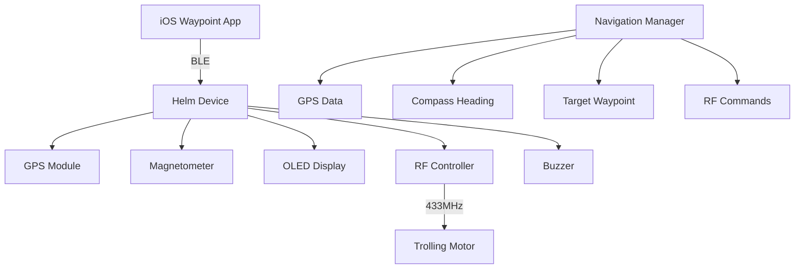

# AutoHelm - GPS Navigation System

An Arduino-based autonomous GPS navigation system with compass-guided navigation, real-time GPS tracking, OLED display feedback, and wireless waypoint management through a companion iOS app.

## Project Overview

AutoHelm is a comprehensive navigation system designed for autonomous GPS-guided navigation with user control via Bluetooth. The system provides compass-guided navigation with real-time GPS tracking, visual feedback through an OLED display, and wireless waypoint management through a companion iOS app.

### Key Features

- **Autonomous GPS Navigation**: Real-time waypoint guidance with compass bearing calculations
- **Compass Calibration System**: Magnetometer calibration with live data streaming
- **Visual Feedback**: 128x64 OLED display with navigation arrows and status information
- **Bluetooth Low Energy**: Wireless communication with iOS companion app
- **RF Motor Control**: 433MHz wireless control for compatible trolling motors
- **Offline Map Support**: Download and store OpenStreetMap tiles for offline navigation
- **Waypoint Management**: Create, edit, and manage waypoints with photos and custom icons
- **Audio Feedback**: Buzzer notifications for navigation events and status changes

### Technology Stack

**Arduino Hardware:**
- Arduino UNO R4 WiFi
- U-blox NEO-6M Compatible GPS Module
- PiicoDev Magnetometer MMC5603
- PiicoDev OLED Display Module (128x64) SSD1306
- Adafruit RFM69HCW Transceiver Radio Breakout - 433 MHz
- ArduinoBLE library for Bluetooth communication

**iOS App:**
- Swift 5.0
- SwiftUI framework
- MapKit for mapping functionality
- Core Location for GPS services
- Core Bluetooth for BLE communication
- iOS 18.5+ deployment target

## Architecture

### System Design



### Component Interactions

- **GPS Manager**: Handles GPS module communication and position data parsing
- **Compass Manager**: Manages magnetometer readings and calibration procedures
- **Navigation Manager**: Core navigation logic, bearing calculations, and heading corrections
- **Display Manager**: OLED screen management with navigation arrows and status display
- **RF Controller**: 433MHz radio communication for motor control
- **BLE GPS Receiver**: Bluetooth communication with iOS app for waypoint transmission

### Data Flow

1. GPS module provides current position and satellite information
2. Magnetometer provides compass heading with calibration corrections
3. iOS app transmits target waypoints via Bluetooth Low Energy
4. Navigation Manager calculates bearing and distance to target
5. System displays navigation arrow and sends RF commands for course corrections
6. Real-time status transmitted back to iOS app

## Bluetooth Communication Architecture

Based on the AutoHelm implementation, this section describes the best-practice architecture for Bluetooth Low Energy (BLE) communication between the Arduino UNO R4 WiFi and iPhone. The Arduino UNO R4 WiFi uses its built-in ESP32 co-processor for BLE (via the ArduinoBLE library), supporting peripheral mode with low power consumption but constraints like a maximum MTU of ~512 bytes (typically negotiated to 23-185 bytes in practice) and limited concurrent connections.

### 1. Overview

**BLE Role Assignment:**
- Arduino UNO R4 WiFi acts as the **Peripheral** (advertises and provides services)
- iPhone acts as the **Central** (scans, connects, and interacts with characteristics)

**Key Data Flows:**
- **From iPhone to Arduino**: GPS waypoints (target locations) and commands (enable/disable navigation, start calibration)
- **From Arduino to iPhone**: GPS status (current position, satellites, heading) and responses (calibration data, acknowledgments)

**Design Principles:**
- **Efficiency**: Use compact, text-based formats (NMEA-inspired strings or JSON) to fit within BLE packet limits (~20-500 bytes per write/notify)
- **Reliability**: Implement notifications for real-time updates, acknowledgments for critical commands, and auto-reconnection logic
- **Power Optimization**: Leverage BLE's low-energy features; advertise only when needed, use short connection intervals (15-30ms), and minimize data transmission frequency (status updates every 1-5 seconds)
- **Security**: Use pairing if sensitive data is involved, but keep it optional for simplicity
- **Limitations Addressed**: No classic Bluetooth (only BLE on UNO R4 WiFi); handle iOS background mode restrictions; avoid high-bandwidth transfers

### 2. BLE Service Definition

Define a single custom GATT service to encapsulate all functionality, reducing discovery overhead.

- **Service UUID**: `0000FFE0-0000-1000-8000-00805F9B34FB`
- **Advertisement Data**: Arduino advertises with the device name "Helm" and the service UUID
- **MTU Negotiation**: Request a higher MTU (e.g., 185 bytes) during connection to allow larger JSON payloads, but fallback gracefully if negotiated lower

### 3. Characteristics

Use 5 characteristics within the service, each with specific properties (Read, Write, Notify):

| Characteristic UUID | Properties | Purpose | Data Format | Max Size |
|---------------------|------------|---------|-------------|----------|
| `0000FFE1-0000-1000-8000-00805F9B34FB` | Write (No Response) | Send GPS waypoints or targets from iPhone to Arduino | NMEA-like string: `$GPS,lat,lon,alt*` (e.g., `$GPS,-32.940931,151.718029,45.2*`) | 50 bytes |
| `0000FFE2-0000-1000-8000-00805F9B34FB` | Notify | Stream GPS status and responses from Arduino to iPhone (current position, fix quality) | JSON object (e.g., `{"has_fix":true,"satellites":8,"lat":-32.940931,"lon":151.718029,"heading":127.5,"dop":1.2}`) | 200 bytes |
| `0000FFE3-0000-1000-8000-00805F9B34FB` | Write (No Response) | Send commands from iPhone to Arduino (navigation control, calibration) | String commands: `NAV_ENABLE`, `NAV_DISABLE`, `START_CAL`, `STOP_CAL`, etc. | 30 bytes |
| `0000FFE4-0000-1000-8000-00805F9B34FB` | Notify | Stream real-time data like calibration readings or command acknowledgments from Arduino | JSON (e.g., `{"cmd":"NAV_ENABLE","status":"OK"}` or calibration: `{"x":25.4,"y":-15.2,"z":67.8}`) | 100 bytes |
| `0000FFE5-0000-1000-8000-00805F9B34FB` | Read/Write | Device configuration (read firmware version, write settings like update interval) | JSON (e.g., `{"version":"1.0","interval_ms":1000}`) | 50 bytes |

**Best Practices:**
- Use "Write Without Response" for low-latency commands/waypoints to avoid blocking
- Enable notifications on connect for streaming (iPhone subscribes via `setNotifyValue(true)`)
- Fragment large data if exceeding MTU (rare here, as payloads are small)

### 4. Data Protocols

**Serialization:**
- **Strings for Simplicity**: Use ASCII/UTF-8; terminate with `*` for waypoints to enable easy parsing on Arduino
- **JSON for Structured Data**: Compact keys (e.g., "lat" instead of "latitude") to save bytes. Use libraries like ArduinoJson on Arduino and JSONEncoder/Decoder on iOS
- **Error Codes**: Include in responses (e.g., `{"status":"ERR_INVALID_CMD"}`) for robustness

**Transmission Frequency:**
- Status notifications: Every 1-2 seconds when active; reduce to 5-10 seconds in idle mode
- Commands/Waypoints: On-demand (e.g., user taps in app)

**Validation:**
- **Arduino**: Parse incoming data, validate checksums (e.g., simple XOR for strings), and send ACK/NAK via notify
- **iPhone**: Handle partial data with timeouts (e.g., 5s retry)

### 5. Connection Management

**Advertising (Arduino):**
```cpp
// Start advertising on boot
BLE.begin();
BLE.setLocalName("Helm");
BLE.advertise();
// Stop/restart advertising based on battery or state to save power
```

**Scanning and Connection (iPhone):**
- Use `CBCentralManager` to scan for the service UUID
- **Auto-reconnect**: Implement a timer (every 2s) to rescan if disconnected
- Handle states: Monitor `peripheral.state` and reconnect on `.disconnected`

**Background Mode (iOS):**
- Enable "Uses Bluetooth LE accessories" in `UIBackgroundModes` (Info.plist) for continued operation in background
- Request always authorization for Bluetooth to persist connections

**Disconnection Handling:**
- **Graceful teardown**: On disconnect, reset states (e.g., disable navigation)
- **Reconnection Policy**: iPhone retries up to 3 times before notifying user

### 6. Error Handling and Reliability

**Common Errors:**
- **Connection Failures**: Log and retry (e.g., due to interference on 2.4GHz band)
- **Data Corruption**: Use checksums in strings; validate JSON parsing
- **Permissions**: iPhone prompts for Bluetooth/Location; handle denials with UI alerts

**Best Practices:**
- **Queuing**: On Arduino, queue outgoing notifications if not connected
- **Timeouts**: 5-10s for responses; resend commands if no ACK
- **Logging**: Use Serial on Arduino and Xcode console on iOS for debugging
- **Testing**: Simulate drops with `BLE.disconnect()`; use tools like LightBlue app for iOS to mock peripherals

### 7. Security Considerations

- **Pairing/Bonding**: Optional; enable if GPS data is sensitive (use `BLE.setPairable(true)` on Arduino). iPhones support just-works pairing
- **Encryption**: BLE inherently supports link-layer encryption post-pairing
- **Data Privacy**: Avoid transmitting unnecessary personal data; comply with iOS location permissions
- **Limitations**: No advanced auth on UNO R4 WiFi; rely on app-level checks if needed

### 8. Implementation Tips

**Arduino Side (C++ with ArduinoBLE):**
```cpp
// Initialize: In setup(), create service/characteristics and add to BLE
BLEService gpsService("FFE0");
BLEStringCharacteristic waypointChar("FFE1", BLEWrite, 50);
// ... Add others

void loop() {
    if (BLE.connected()) {
        if (waypointChar.written()) {
            // Parse and process
            statusChar.writeValue("{\"status\":\"OK\"}");
        }
    }
}
```

**iOS Side (Swift with Core Bluetooth):**
```swift
class BluetoothManager: NSObject, CBCentralManagerDelegate {
    var centralManager: CBCentralManager!
    var peripheral: CBPeripheral?
    
    override init() {
        centralManager = CBCentralManager(delegate: self, queue: nil)
    }
    
    func sendWaypoint(lat: Double, lon: Double) {
        let data = Data("$GPS,\(lat),\(lon),0*".utf8)
        peripheral?.writeValue(data, for: waypointChar, type: .withoutResponse)
    }
    // Handle discoveries, connections, and notifications
}
```

**Integration with Project:**
- Align with AutoHelm's non-blocking init (e.g., `bleAvailable = gpsReceiver.begin("Helm")`)
- Test incrementally: Start with connection, then add waypoints, then status streaming

This architecture is scalable, fits within hardware limits, and builds directly on AutoHelm's proven design. The system prioritizes low-latency, low-power exchanges suitable for real-time GPS data and commands, avoiding unnecessary complexity to minimize overhead.

## Prerequisites

### Hardware Requirements

**Core Components:**
- Arduino UNO R4 WiFi
- U-blox NEO-6M Compatible GPS Module
- PiicoDev Magnetometer MMC5603 (I2C)
- PiicoDev OLED Display Module 128x64 SSD1306 (I2C)
- Adafruit RFM69HCW Transceiver Radio Breakout - 433 MHz (SPI)
- Buzzer (Pin 4)
- Prototyping Shield For Arduino

**Connections:**
- PiicoDev Cables for I2C devices
- Jumper Wire 20cm Ribbon M/F for connections
- RTL-SDR Blog V4 USB Dongle with Dipole Antenna Kit (for testing RF)

**Software Requirements:**
- Arduino IDE 2.0+
- Xcode 15.0+ (for iOS app)
- iOS device running iOS 18.5+

### Arduino Libraries Required

```cpp
#include <ArduinoBLE.h>          // Bluetooth Low Energy
#include <Adafruit_MMC56x3.h>    // Magnetometer
#include <Adafruit_GFX.h>        // Graphics library
#include <Adafruit_SSD1306.h>    // OLED display
#include <SoftwareSerial.h>      // GPS communication
#include <SPI.h>                 // RF module communication
#include <Wire.h>                // I2C communication
```

## Installation

### Hardware Setup

1. **Mount Components on Prototyping Shield:**
   ```
   Arduino UNO R4 WiFi
   ├── I2C (SDA/SCL) → PiicoDev Magnetometer & OLED
   ├── Digital Pin 2,3 → GPS Module (RX,TX)
   ├── Digital Pin 4 → Buzzer
   ├── SPI (10,11,12,13) → RFM69HCW (CS,MOSI,MISO,SCK)
   └── Digital Pin 9 → RFM69HCW Reset
   ```

2. **Power Connections:**
   - All modules connect to 3.3V and GND
   - Arduino powered via USB or external 7-12V supply

3. **I2C Address Configuration:**
   - OLED Display: 0x3C
   - Magnetometer: 0x30 (default MMC5603)

### Arduino Firmware Installation

1. **Clone Repository:**
   ```bash
   git clone https://github.com/brentonford/AutoHelm.git
   cd AutoHelm/Helm
   ```

2. **Install Required Libraries:**
   - Open Arduino IDE
   - Go to Library Manager
   - Install: ArduinoBLE, Adafruit MMC56x3, Adafruit SSD1306, Adafruit GFX

3. **Upload Firmware:**
   ```bash
   # Open Helm.ino in Arduino IDE
   # Select Board: Arduino UNO R4 WiFi
   # Select appropriate COM port
   # Upload sketch
   ```

### iOS App Installation

1. **Development Setup:**
   ```bash
   cd AutoHelm/Waypoint
   open Waypoint.xcodeproj
   ```

2. **Configure Development Team:**
   - Open project settings
   - Set Development Team in Signing & Capabilities
   - Update Bundle Identifier if needed

3. **Build and Run:**
   - Select target device
   - Build and run (Cmd+R)

## Configuration

### Arduino Configuration

**System Constants (DataModels.cpp):**
```cpp
const float SystemConfig::HEADING_TOLERANCE = 15.0;        // Degrees
const float SystemConfig::MIN_CORRECTION_INTERVAL = 2000;  // Milliseconds
const float SystemConfig::MIN_DISTANCE_METERS = 5.0;       // Meters
const int SystemConfig::BUZZER_PIN = 4;
const int SystemConfig::GPS_RX_PIN = 2;
const int SystemConfig::GPS_TX_PIN = 3;
const uint8_t SystemConfig::SCREEN_ADDRESS = 0x3C;
```

**RF Configuration (433.032 MHz):**
```cpp
// RfController.cpp - FSK mode configuration
// Frequency: 433.032 MHz
// Modulation: FSK
// Power: Maximum (+20dBm)
// Burst Pattern: 4 pulses, 14ms on, 54ms gap
```

**Compass Calibration:**
```cpp
// Default calibration values in CompassCalibration struct
// Run calibration procedure via iOS app for accurate readings
```

### iOS App Configuration

**Permissions (Info.plist):**
```xml
<key>NSBluetoothAlwaysUsageDescription</key>
<string>This app uses Bluetooth to connect to the Helm navigation device</string>
<key>NSLocationWhenInUseUsageDescription</key>
<string>This app uses location services for navigation purposes</string>
```

## Usage

### Basic Operation

1. **Power On System:**
   ```
   Arduino boots → Display shows "Helm is starting..." → GPS acquiring fix
   ```

2. **Connect iOS App:**
   ```
   Open Waypoint app → Bluetooth scans for "Helm" → Connect
   ```

3. **Set Waypoint:**
   ```
   iOS app → Tap map location → Send to Helm → Enable navigation
   ```

4. **Navigation Active:**
   ```
   Display shows arrow pointing to target
   System sends RF commands for course corrections
   Audio feedback for navigation events
   ```

### GPS Protocol

**GPSParser Library Integration:**
This project utilizes the GPSParser library: https://github.com/brentonford/Arduino-Libraries-GPSParser

**Waypoint Transmission Format:**
```
$GPS,latitude,longitude,altitude*
Example: $GPS,-32.940931,151.718029,45.2*
```

**Status Data (JSON):**
```json
{
  "has_fix": true,
  "satellites": 8,
  "currentLat": -32.940931,
  "currentLon": 151.718029,
  "altitude": 45.2,
  "speed_knots": 2.3,
  "time": "14:30:52",
  "date": "23/01/25",
  "hdop": 1.2,
  "vdop": 1.8,
  "pdop": 2.1,
  "heading": 127.5,
  "distance": 245.8,
  "bearing": 89.2,
  "targetLat": -32.941234,
  "targetLon": 151.718567
}
```

**Dilution of Precision (DOP) Values:**
- `hdop`, `vdop`, and `pdop` represent horizontal, vertical, and overall positional accuracy ratings
- Lower values indicate better GPS accuracy (values under 5.0 are considered good readings)
- These values help assess the reliability of the GPS position fix


### Compass Calibration

1. **Start Calibration:**
   ```
   iOS app → Settings → Calibration → Start Calibration
   ```

2. **Calibration Procedure:**
   ```
   Slowly rotate device in all directions
   Continue for 2-3 minutes until readings stabilize
   Save calibration when complete
   ```

3. **Live Calibration Data:**
   ```json
   {
     "x": 25.4, "y": -15.2, "z": 67.8,
     "minX": -73.95, "minY": -6.86, "minZ": -55.41,
     "maxX": 31.91, "maxY": 101.72, "maxZ": 54.58
   }
   ```

## Features Documentation

### Navigation System (NavigationManager.cpp)

**Core Functionality:**
- Calculates distance using Haversine formula
- Determines bearing to target waypoint
- Provides heading corrections via RF control
- Manages destination arrival detection

**Key Methods:**
```cpp
void setTarget(float latitude, float longitude)
void update(const GPSData& gpsData, float heading)
void adjustHeading(float relativeAngle)
bool shouldCorrectHeading(float relativeAngle)
```

### Display System (DisplayManager.cpp)

**Visual Elements:**
- Navigation arrow pointing to target
- GPS coordinates and satellite count
- Connection status icons
- Distance to target
- Current altitude

**Screen Layout:**
```
┌─────────────────────────┐
│ GPS: 8 sats  [●] [📍]  │
│ -32.940931  151.718029  │
│                         │
│         ↗               │
│                         │
│ Target: -32.941234      │
│        151.718567       │
│                         │
│ 245m            45.2m   │
└─────────────────────────┘
```

### RF Control System (RfController.cpp)

**RFM69HCW Configuration:**
- Frequency: 433.032 MHz
- Modulation: FSK
- Power: +20dBm maximum

**Burst Pattern:**
```cpp
// 4 bursts per command
// 14ms transmission, 54ms gap
// Left/Right commands for motor control
```

### Audio Feedback (NavigationUtils.cpp)

**Sound Events:**
```cpp
playNavigationEnabled()    // 150-523Hz ascending
playWaypointSet()         // 800-659Hz confirmation
playGpsFixLost()          // 523-150Hz descending
playGpsFixed()            // 800Hz triple beep + ascending
playAppConnected()        // 392-659Hz melody
playAppDisconnected()     // 330-150Hz descending
playDestinationReached()  // 523-392Hz celebration
```

### iOS Waypoint Management

**Map Features:**
- Interactive map with tap-to-create waypoints
- Satellite/hybrid map modes
- Search functionality with OpenStreetMap
- Offline tile downloading and caching
- Custom waypoint icons and photos

**Waypoint Properties:**
```swift
struct Waypoint {
    let id: UUID
    let coordinate: CLLocationCoordinate2D
    var name: String
    var comments: String
    var photoData: Data?
    var iconName: String
    let createdDate: Date
    var lastUpdatedDate: Date
}
```

## Development

### Project Structure

```
autohelm/
├── Helm/                     # Arduino firmware
│   ├── Helm.ino             # Main application
│   ├── DataModels.h/.cpp    # System configuration
│   ├── GPSManager.h/.cpp    # GPS module interface
│   ├── CompassManager.h/.cpp # Magnetometer interface
│   ├── NavigationManager.h/.cpp # Core navigation logic
│   ├── DisplayManager.h/.cpp # OLED display control
│   ├── RfController.h/.cpp  # 433MHz RF control
│   ├── GPSReceiver.h/.cpp   # BLE communication
│   └── NavigationUtils.h/.cpp # Math utilities & audio
│
└── Waypoint/                # iOS companion app
    ├── Waypoint/
    │   ├── ContentView.swift # Main app interface
    │   ├── Models/
    │   │   └── DataModels.swift # Shared data structures
    │   ├── Managers/
    │   │   ├── BluetoothManager.swift # BLE communication
    │   │   ├── LocationManager.swift  # GPS services
    │   │   ├── WaypointManager.swift  # Waypoint storage
    │   │   └── OfflineTileManager.swift # Map caching
    │   ├── Views/
    │   │   ├── WaypointViews/        # Map and waypoint UI
    │   │   ├── StatusViews/          # Device status display
    │   │   └── SettingsViews/        # Configuration UI
    │   ├── Components/               # Reusable UI elements
    │   └── Utilities/               # Helper functions
    └── Waypoint.xcodeproj
```

### Key Implementation Details

**Non-blocking Hardware Initialization:**
```cpp
// Helm.ino - graceful degradation
displayAvailable = displayManager.begin();
compassAvailable = compassManager.begin();
bleAvailable = gpsReceiver.begin("Helm");
```

**Thread-safe BLE Communication:**
```swift
// BluetoothManager.swift - auto-reconnection
private func startAutoScanTimer() {
    autoScanTimer = Timer.scheduledTimer(withTimeInterval: 2.0, repeats: true) {
        if !self.isConnected && self.centralManager.state == .poweredOn {
            self.startScanning()
        }
    }
}
```

**Haversine Distance Calculation:**
```cpp
// NavigationUtils.cpp - precise GPS calculations
float NavigationUtils::calculateDistance(float lat1, float lon1, float lat2, float lon2) {
    // Convert to radians and apply Haversine formula
    // Returns distance in meters
}
```

### Adding New Features

1. **New Arduino Sensor:**
   ```cpp
   // Create SensorManager.h/.cpp
   // Add to component initialization in setup()
   // Integrate with main loop update cycle
   ```

2. **New iOS View:**
   ```swift
   // Add to Views/ directory
   // Register in ContentView navigation
   // Add to TabView if needed
   ```

3. **New BLE Command:**
   ```cpp
   // Arduino: Add to handleCalibrationCommand()
   // iOS: Add method to BluetoothManager
   // Update protocol documentation
   ```

## Testing

### Hardware Testing

**Component Verification:**
```cpp
// Serial monitor output during startup
SERIAL COMMUNICATION TEST - IF YOU SEE THIS, SERIAL IS WORKING
=== Helm System Starting ===
Initializing OLED display... SUCCESS
Initializing GPS... SUCCESS  
Initializing compass... SUCCESS
Initializing BLE GPS Receiver... SUCCESS
```

**GPS Testing:**
```bash
# Monitor GPS data via serial
# Should show satellites and coordinates when fix acquired
Time: 123045, Satellites: 8, Position: -32.940931, 151.718029
```

**RF Testing:**
```bash
# Serial commands for manual RF testing
'r' - Transmit right turn command
'l' - Transmit left turn command  
't' - Test transmission
'd' - Debug RF module info
```

### iOS App Testing

**BLE Connection Test:**
- App should auto-discover "Helm" device
- Connection status indicators should update
- Status data should stream from device

**Map Functionality:**
- Tap-to-create waypoints
- Search and waypoint transmission
- Offline map downloading

### Hardware Considerations

**Power Management:**
- Arduino UNO R4 WiFi: ~200mA typical
- GPS module: ~45mA acquisition, ~20mA tracking
- OLED display: ~20mA active
- Consider external battery pack for extended operation

**Environmental Protection:**
- Waterproof enclosure recommended for marine use
- GPS antenna placement for clear sky view
- RF antenna orientation for optimal range

## Troubleshooting

### Common Issues

**GPS Not Acquiring Fix:**
```
Check: Clear sky view, antenna connections
Debug: Monitor serial output for satellite count
Fix: Allow 2-5 minutes for cold start acquisition
```

**Compass Readings Incorrect:**
```
Issue: Magnetic interference or uncalibrated
Solution: Run calibration procedure away from metal objects
Check: Magnetometer I2C connection and address
```

**BLE Connection Fails:**
```
Check: iOS Bluetooth permissions enabled
Debug: Monitor Arduino serial for BLE initialization
Reset: Power cycle both devices and retry
```

**OLED Display Blank:**
```
Check: I2C connections (SDA/SCL)
Debug: Monitor serial for display init messages
Verify: Display address 0x3C is correct
```

**RF Commands Not Working:**
```
Check: RFM69HCW SPI connections and power
Debug: Use 'd' command to verify RF module status
Test: Use RTL-SDR to verify 433MHz transmissions
```

### Debug Mode

**Enable Verbose Logging:**
```cpp
// Uncomment in Helm.ino
#define DEBUG_MODE
// Provides detailed serial output for all subsystems
```

**iOS Debug Console:**
```swift
// Xcode Console shows BLE communication details
// Enable Bluetooth logs in iOS Settings → Developer
```

## API Reference

### BLE Protocol

The BLE protocol follows the comprehensive architecture outlined in the [Bluetooth Communication Architecture](#bluetooth-communication-architecture) section.

**Service UUID:** `0000FFE0-0000-1000-8000-00805F9B34FB`

**Characteristics:**

| UUID | Type | Purpose |
|------|------|---------|
| 0000FFE1 | Write (No Response) | GPS waypoint data |
| 0000FFE2 | Notify | Navigation status |
| 0000FFE3 | Write (No Response) | Calibration commands |
| 0000FFE4 | Notify | Calibration data |
| 0000FFE5 | Read/Write | Device configuration |

**Commands:**
```
START_CAL          - Begin compass calibration
STOP_CAL          - End calibration
NAV_ENABLE        - Enable navigation
NAV_DISABLE       - Disable navigation
RF_PAIR_START     - Begin RF remote pairing
RF_PAIR_COMPLETE  - Complete pairing
RF_PAIR_CANCEL    - Cancel pairing
```

### Arduino Public Methods

```cpp
// NavigationManager
void setTarget(float lat, float lon)
void setNavigationEnabled(bool enabled)
NavigationState getState()

// CompassManager  
float readHeading()
void startCalibration()
void stopCalibration()

// DisplayManager
void updateDisplay(GPSData, float heading, NavigationState, bool connected)
void showCalibrationScreen(float x, float y, float z)

// RfController
void transmitRightButton()
void transmitLeftButton()
bool isInitialized()
```

### iOS Public Interface

```swift
// BluetoothManager
func sendWaypoint(latitude: Double, longitude: Double)
func startCalibration()
func stopCalibration()  
func setNavigationEnabled(_ enabled: Bool)

// WaypointManager
func saveWaypoint(_ waypoint: Waypoint)
func deleteWaypoint(id: UUID)
func updateWaypoint(id: UUID, name: String?, comments: String?)

// OfflineTileManager
func downloadTiles(region: MKCoordinateRegion, minZoom: Int, maxZoom: Int)
func clearCache()
```

## Hardware Specifications

### Supported Modules

**GPS Module:**
- U-blox NEO-6M Compatible
- Update rate: 1-10 Hz
- Accuracy: 2.5m CEP
- Protocols: NMEA, UBX

**Magnetometer:**  
- PiicoDev MMC5603
- Resolution: 0.0625 mG/LSB
- Range: ±30 Gauss
- Interface: I2C (0x30)

**Display:**
- PiicoDev OLED 128x64 SSD1306
- Pixel count: 8192
- Interface: I2C (0x3C)
- Power: 3.3V, ~20mA

**RF Module:**
- Adafruit RFM69HCW
- Frequency: 433 MHz
- Power: +20dBm max
- Interface: SPI
- Modulation: FSK/OOK

## Contributing

### Development Setup

1. **Arduino Environment:**
   ```bash
   # Install Arduino IDE 2.0+
   # Add required libraries
   # Connect hardware as per wiring diagram
   ```

2. **iOS Development:**
   ```bash
   # Xcode 15.0+ required
   # iOS 18.5+ deployment target
   # Apple Developer account for device testing
   ```

### Coding Standards

**Arduino (C++):**
- Use camelCase for variables and functions
- Include types where possible
- 4-space indentation
- Comment hardware dependencies

**iOS (Swift):**
- Follow Swift API Design Guidelines
- Use SwiftUI for all new UI components
- Implement proper error handling
- Document public interfaces

### Commit Message Format

```
feat: add compass calibration via BLE
fix: resolve GPS parsing for specific modules  
docs: update hardware wiring diagram
test: add unit tests for navigation calculations
```

### Pull Request Process

1. Fork repository and create feature branch
2. Implement changes with appropriate tests
3. Update documentation for new features
4. Submit PR with detailed description
5. Address review feedback

## License

This project is licensed under the MIT License - see the LICENSE file for details.

### Third-Party Components

- **Arduino Libraries:** Various licenses (check individual libraries)
- **OpenStreetMap:** Open Database License (ODbL)
- **iOS Dependencies:** See individual package licenses

## Credits

**Hardware Components:**
- PiicoDev for I2C modules and ecosystem
- Adafruit for RFM69HCW radio module
- Arduino for the UNO R4 WiFi platform

**Software Libraries:**
- ArduinoBLE for Bluetooth Low Energy
- Adafruit GFX and SSD1306 for display control
- Apple MapKit and Core Location frameworks

**Testing and Development:**
- RTL-SDR for RF signal analysis and verification
- OpenStreetMap contributors for mapping data

For technical support or questions, please open an issue in the GitHub repository.