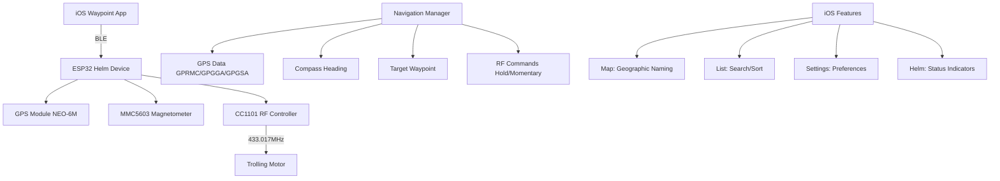

# AutoHelm - GPS Navigation System

AutoHelm is a comprehensive navigation system designed for autonomous GPS-guided navigation with user control of electric boat motors. The system provides compass-guided navigation with real-time GPS tracking, and wireless waypoint management through a companion iOS app.

## Key Features

- **Autonomous GPS Navigation**: Real-time waypoint guidance with compass bearing calculations and automatic steering
- **Helm Navigation Control**: GPS-guided motor control with safety validation and auto-disable features
- **Compass Calibration System**: Magnetometer calibration with live data streaming
- **Bluetooth Low Energy**: Wireless communication with iOS companion app
- **RF Motor Control**: 433MHz wireless control with hold and momentary button modes
- **Offline Map Support**: Download and store OpenStreetMap tiles for offline navigation
- **Waypoint Management**: Create, edit, and manage waypoints with automatic geographic naming
- **Search and Sort**: Find waypoints quickly with searchable, sortable lists
- **Real-time Status**: Live indicators for Connection, GPS, Compass, and Navigation status

## Technology Stack

**ESP32 Hardware:**
- ESP32 DevKit (WROOM-32 or similar)
- U-blox NEO-6M Compatible GPS Module
- PiicoDev Magnetometer MMC5603 (I2C)
- CC1101 433MHz RF Transceiver Module

**iOS App:**
- Swift 5.0
- SwiftUI framework
- MapKit for mapping functionality
- Core Location for GPS services
- Core Bluetooth for BLE communication
- iOS 17.0+ deployment target

## Architecture

### System Design


```mermaid
graph TB
    A[iOS Waypoint App] -->|BLE| B[ESP32 Helm Device]
    B --> C[GPS Module NEO-6M]
    B --> D[MMC5603 Magnetometer]
    B --> F[CC1101 RF Controller]
    F -->|433.017MHz| H[Trolling Motor]
    
    I[Navigation Manager] --> J[GPS Data GPRMC/GPGGA/GPGSA]
    I --> K[Compass Heading]
    I --> L[Target Waypoint]
    I --> M[RF Commands Hold/Momentary]
    
    N[iOS Features] --> O[Map: Geographic Naming]
    N --> P[List: Search/Sort]
    N --> Q[Settings: Preferences]
    N --> R[Helm: Status Indicators]
```

### Component Interactions

- **GPS Manager**: Handles GPS module communication and NMEA parsing (GPRMC, GPGGA, GPGSA)
- **Compass Manager**: Manages magnetometer readings and calibration procedures
- **Navigation Manager**: Core navigation logic, bearing calculations, and heading corrections
- **RF Controller**: CC1101 433MHz radio communication for motor control using RMT peripheral
- **BLE Manager**: Bluetooth communication with iOS app for waypoint transmission

### Data Flow

1. GPS module provides current position and satellite information via UART
2. Magnetometer provides compass heading with calibration corrections via I2C
3. iOS app transmits target waypoints via Bluetooth Low Energy
4. Navigation Manager calculates bearing and distance to target
5. System sends RF commands via CC1101 for course corrections (automatic steering)
6. Real-time status transmitted back to iOS app

## Prerequisites

### Hardware Requirements

**Core Components:**
- ESP32 DevKit (WROOM-32, WROVER, or similar with 4MB+ flash)
- U-blox NEO-6M Compatible GPS Module
- PiicoDev Magnetometer MMC5603 (I2C address 0x30)
- CC1101 433MHz RF Transceiver Module
- RTL-SDR Blog V4 USB Dongle with Dipole Antenna Kit (for testing RF)

**Pin Configuration:**

| Function | GPIO | Notes |
|----------|------|-------|
| CC1101 CS | 5 | SPI Chip Select |
| CC1101 GDO0 | 4 | TX Data (RMT output) |
| CC1101 SCK | 18 | SPI Clock |
| CC1101 MISO | 19 | SPI Data In |
| CC1101 MOSI | 23 | SPI Data Out |
| GPS RX | 16 | UART2 RX (from GPS TX) |
| GPS TX | 17 | UART2 TX (to GPS RX) - Optional |
| I2C SDA | 21 | Magnetometer |
| I2C SCL | 22 | Magnetometer |

### Software Requirements

- Arduino IDE 2.0+ with ESP32 board support, or PlatformIO
- Xcode 15.0+ (for iOS app)
- iOS device running iOS 17.0+
- macOS 13.0+ (for iOS development)

### ESP32 Board Setup

1. **Add ESP32 Board Support:**
   - Open Arduino IDE Preferences
   - Add to Additional Board Manager URLs:
     ```
     https://raw.githubusercontent.com/espressif/arduino-esp32/gh-pages/package_esp32_index.json
     ```
   - Open Board Manager and install "esp32 by Espressif Systems"

2. **Select Board:**
   - Board: "ESP32 Dev Module" or your specific variant
   - Upload Speed: 921600
   - Flash Frequency: 80MHz
   - Flash Mode: QIO
   - Partition Scheme: Default 4MB with spiffs

### Required Libraries

```cpp
#include <WiFi.h>               // ESP32 WiFi (for BLE coexistence)
#include <BLEDevice.h>          // ESP32 BLE
#include <BLEServer.h>
#include <BLEUtils.h>
#include <BLE2902.h>
#include <Wire.h>               // I2C
#include <SPI.h>                // SPI for CC1101
#include <driver/rmt.h>         // RMT peripheral for precise timing
#include <esp_pm.h>             // Power management
#include <Adafruit_MMC56x3.h>   // Magnetometer
#include <HardwareSerial.h>     // GPS UART
```

Install via Library Manager:
- Adafruit MMC56x3

## Installation

### Hardware Setup

```
ESP32 DevKit
├── SPI Bus → CC1101 RF Module
│   ├── GPIO 5  → CS
│   ├── GPIO 18 → SCK
│   ├── GPIO 19 → MISO
│   ├── GPIO 23 → MOSI
│   └── GPIO 4  → GDO0 (TX data)
│
├── I2C Bus (GPIO 21 SDA, GPIO 22 SCL)
│   └── MMC5603 Magnetometer (0x30)
│
└── UART2 → GPS Module
    ├── GPIO 16 → GPS TX (data from GPS)
    └── GPIO 17 → GPS RX (optional, for configuration)
```

**Power Connections:**
- CC1101: 3.3V only (not 5V tolerant)
- GPS Module: 3.3V or 5V (check module specs - NEO-6M is typically 3.3V)
- Magnetometer: 3.3V
- ESP32: USB or regulated 3.3V supply

**CRITICAL:** Do NOT connect 5V to 3.3V-only modules!

### Firmware Installation

1. **Clone Repository:**
   ```bash
   git clone https://github.com/brentonford/AutoHelm.git
   cd AutoHelm/Helm
   ```

2. **Install Required Libraries:**
   - Open Arduino IDE Library Manager
   - Install: Adafruit MMC56x3

3. **Upload Firmware:**
   - Select Board: ESP32 Dev Module
   - Select appropriate COM port
   - Upload sketch

### iOS App Installation

1. **Development Setup:**
   ```bash
   cd AutoHelm/Waypoint
   open Waypoint.xcodeproj
   ```

2. **Configure Development Team:**
   - Open project settings
   - Set Development Team in Signing & Capabilities
   - Update Bundle Identifier if needed

3. **Build and Run:**
   - Select target device
   - Build and run (Cmd+R)

## Configuration

### System Constants

```cpp
// Pin Configuration
constexpr uint8_t PIN_CC1101_CS   = 5;
constexpr uint8_t PIN_CC1101_GDO0 = 4;
constexpr uint8_t PIN_CC1101_SCK  = 18;
constexpr uint8_t PIN_CC1101_MISO = 19;
constexpr uint8_t PIN_CC1101_MOSI = 23;
constexpr uint8_t PIN_GPS_RX      = 16;
constexpr uint8_t PIN_GPS_TX      = 17;
constexpr uint8_t PIN_I2C_SDA     = 21;
constexpr uint8_t PIN_I2C_SCL     = 22;

// Navigation
constexpr float HEADING_TOLERANCE       = 15.0f;   // Degrees
constexpr float MIN_CORRECTION_INTERVAL = 2000.0f; // Milliseconds
constexpr float MIN_DISTANCE_METERS     = 5.0f;    // Arrival threshold

// I2C Addresses
constexpr uint8_t ADDR_MAGNETOMETER = 0x30;
```

### RF Configuration (CC1101 at 433.017 MHz)

```cpp
// CC1101 Register Configuration for 2-FSK Manchester
// Frequency: 433.017 MHz
writeReg(CC1101Reg::FREQ2, 0x10);
writeReg(CC1101Reg::FREQ1, 0xA7);
writeReg(CC1101Reg::FREQ0, 0x6C);

// Modulation: 2-FSK, async serial mode
writeReg(CC1101Reg::MDMCFG2, 0x00);
writeReg(CC1101Reg::DEVIATN, 0x40);  // ~25 kHz deviation
writeReg(CC1101Reg::PKTCTRL0, 0x32); // Async serial mode

// Manchester encoding via RMT peripheral
// Bit period: 104µs (two 52µs half-bits)
// Bit 0: LOW then HIGH
// Bit 1: HIGH then LOW
```

### Compass Calibration

Run calibration procedure via iOS app for accurate readings. Default calibration values are stored in CompassCalibration struct.

## RF Protocol

### Signal Parameters

| Parameter | Value |
|-----------|-------|
| Frequency | 433.017 MHz |
| Modulation | 2-FSK |
| Encoding | Manchester Code (IEEE 802.3) |
| Deviation | ~25 kHz (TX), ~5 kHz (RX) |
| Bit period | 104 µs |
| Packet length | 137 bits |

### Packet Structure

```
| Preamble | Sync Word | Device ID    | Command   |
| 32 bits  | 32 bits   | 48 bits      | 25 bits   |
| 2aaaaaaa | d391d391  | xxxxxxxxxxxx | varies    |
```

**Note:** Device ID is unique per remote. Capture your specific remote's ID using RTL-SDR.

### Button Behavior

**Hold Buttons (Left/Right):**
- iOS sends `RF_LEFT_HOLD` or `RF_RIGHT_HOLD` on press
- Helm transmits continuously at 68ms intervals while button held
- iOS sends `RF_RELEASE` on button release
- Used for steering control

**Momentary Buttons (Speed+/-, M, Motor):**
- iOS sends single command (e.g., `RF_UP`, `RF_DOWN`, `RF_MOTOR`, `RF_MOMENTARY`)
- Helm transmits for 1000ms then stops automatically
- No release command needed
- Used for speed and motor control

### Button Codes

| Button | Command | Usage | Payload Structure |
|--------|---------|-------|-------------------|
| Right | `08696a8` | Hold | `2aaaaaaad391d391[DeviceID]08696a8` |
| Left | `0269568` | Hold | `2aaaaaaad391d391[DeviceID]0269568` |
| Up | `0469428` | Momentary | `2aaaaaaad391d391[DeviceID]0469428` |
| Down | `806a5a8` | Momentary | `2aaaaaaad391d391[DeviceID]806a5a8` |
| Motor | `4068da8` | Momentary | `2aaaaaaad391d391[DeviceID]4068da8` |
| Momentary | `10693a8` | Momentary | `2aaaaaaad391d391[DeviceID]10693a8` |
| Release | `00e9590` | Auto | `2aaaaaaad391d391[DeviceID]00e9590` |

**Note:** Replace `[DeviceID]` with your captured 48-bit device ID.

## Bluetooth Communication Architecture

### Overview

- ESP32 acts as BLE **Peripheral** (advertises and provides services)
- iPhone acts as **Central** (scans, connects, and interacts with characteristics)

### BLE Service Definition

**Service UUID:** `0000FFE0-0000-1000-8000-00805F9B34FB`
**Device Name:** "Helm"

### Characteristics

| UUID | Properties | Purpose | Format |
|------|------------|---------|--------|
| FFE1 | Write | GPS waypoint data | `$GPS,lat,lon,alt*` |
| FFE2 | Notify | Navigation status | JSON |
| FFE3 | Write | Commands | String |
| FFE4 | Notify | Calibration/responses | JSON |
| FFE5 | Read/Write | Configuration | JSON |

### Commands (FFE3)

**Navigation Commands:**
```
NAV_ENABLE     - Enable navigation (requires valid GPS fix)
NAV_DISABLE    - Disable navigation
START_CAL      - Begin compass calibration
STOP_CAL       - End calibration
```

**RF Motor Control Commands:**
```
RF_LEFT_HOLD   - Start continuous left transmission (hold button)
RF_RIGHT_HOLD  - Start continuous right transmission (hold button)
RF_UP          - Speed increase (1 second pulse)
RF_DOWN        - Speed decrease (1 second pulse)
RF_MOTOR       - Motor toggle (1 second pulse)
RF_MOMENTARY   - Momentary function (1 second pulse)
RF_RELEASE     - Stop hold transmission
```

### Status Format (FFE2)

```json
{
    "has_fix": true,
    "satellites": 8,
    "currentLat": -32.940931,
    "currentLon": 151.718029,
    "altitude": 45.2,
    "hdop": 1.2,
    "heading": 127.5,
    "distance": 245.8,
    "bearing": 89.2,
    "relative": -15.3,
    "targetLat": -32.941234,
    "targetLon": 151.718567,
    "hasTarget": true
}
```

### ESP32 BLE Implementation

The ESP32 uses its native BLE stack (BLEDevice, BLEServer, BLECharacteristic). The implementation creates a GATT server with the service UUID in the advertising packet for iOS discovery. Server callbacks handle connection state changes and automatically restart advertising on disconnect. Each characteristic is configured with appropriate properties (Write for commands/waypoints, Notify for status/calibration) and notify characteristics include a BLE2902 descriptor for client subscription management.

**Key Implementation Details:**
- Server automatically restarts advertising on disconnect
- Command parsing in `BleManager::parseCommand()` handles both navigation and RF commands
- RF commands with `_HOLD` suffix trigger continuous transmission
- RF commands without suffix trigger 1-second pulse transmission
- All responses sent via FFE4 (calibration/response characteristic)
- Navigation status broadcast every 500ms via FFE2

**Safety Features:**
- BLE disconnect immediately stops hold transmissions and sends release command
- Navigation disabled on BLE disconnect
- Hold transmission 30-second timeout prevents infinite transmission
- GPS quality checks before allowing navigation enable

## iOS App Features

### Map Tab

**Real-time Status Indicators:**
- **Connection:** Green (connected), Orange (connecting), Red (disconnected)
- **GPS:** Green (good fix), Orange (poor accuracy), Red (no fix)
- **Compass:** Green (available), Red (not available)
- **Navigation:** Green (enabled & ready), Orange (enabled but blocked), Red (disabled)

**Waypoint Management:**
- Long-press on map to create waypoints with automatic geographic naming
- Tap waypoints to select and view details
- Selected waypoint shows "Active" indicator when configured in Helm
- Send button to transmit waypoint to Helm with auto-enable navigation
- Visual feedback for all actions

**Geographic Naming:**
- Automatically fetches location name using reverse geocoding
- Falls back to numbered names if geocoding fails
- Names include street, city, or region information

### Waypoint List

**Features:**
- Searchable waypoint database
- Sort options:
  - Created date (newest/oldest)
  - Modified date (newest/oldest)
  - Name (A-Z / Z-A)
- Each waypoint displays:
  - Name and coordinates
  - Date created
  - Date modified
  - Edit button
  - Send to Helm button
- Swipe to delete waypoints
- Edit waypoint names with automatic timestamp tracking

### Helm Control Tab

**Status Displays:**
- GPS status with fix quality, satellite count, and position
- Compass heading with visual compass display
- Bearing to target waypoint
- Distance to target
- Course correction indicators

**Autonomous Navigation:**
- Navigation enable/disable toggle (user controlled)
- Navigation blocked indicator (system controlled)
- Blocked reasons displayed: No GPS fix, insufficient satellites, poor accuracy
- Green "Navigation Active" indicator when functioning
- Visual feedback when navigation is waiting for GPS

**Manual Motor Control:**
- Left/Right buttons: Hold to steer (continuous transmission)
- Speed+/- buttons: Tap for 1-second pulse
- Motor/Momentary buttons: Tap for 1-second pulse
- Visual feedback: Blue highlight when active
- Status messages: "Sending LEFT...", "Releasing..."

### Settings Tab

**Connection Management:**
- View current connection status
- Connect/Disconnect button
- Device information

**Navigation Preferences:**
- Auto-enable navigation when sending waypoint
- (Future: Additional navigation settings)

**Display Options:**
- Show coordinates on map markers
- Use metric or imperial units

**About Section:**
- App description and features
- System components list
- GitHub issue reporting link: https://github.com/brentonford/AutoHelm/issues
- Version and license information

## Usage

### Basic Operation

1. **Power On System:**
   - ESP32 boots and initializes all peripherals
   - GPS begins acquiring fix (30-60 seconds outdoors)
   - Watch for "[GPS] *** FIRST FIX ACQUIRED ***" message

2. **Connect iOS App:**
   - Open Waypoint app
   - Bluetooth scans for "Helm"
   - Tap to connect
   - Status indicators show green when ready

3. **Set Waypoint:**
   - Long-press map location in iOS app
   - Edit name if desired
   - Tap "Add" to save
   - Select waypoint from map or list
   - Tap "Send to Helm & Enable Navigation"

4. **Navigation Active:**
   - System automatically steers toward waypoint
   - Green "Navigation Active" indicator displayed
   - Status updates sent to iOS app via BLE
   - Arrival notification within 5 meters

### Helm Navigation Safety Features

**Enable Conditions:**
- Valid GPS fix with satellites ≥ 4
- Dilution of Precision (HDOP) < 5.0
- Target waypoint set
- Bluetooth connection stable

**Auto-Disable Triggers:**
- GPS fix loss
- DOP degradation (poor accuracy)
- Bluetooth disconnect
- Arrival at destination (within 5 meters)
- 30-second hold transmission timeout

**Navigation States:**
- **Disabled:** User has not enabled navigation
- **Enabled & Blocked:** Navigation enabled but GPS quality insufficient
- **Enabled & Ready:** All conditions met, autonomous steering active

### Serial Commands (Debug)

| Command | Action |
|---------|--------|
| `R` | Hold right |
| `L` | Hold left |
| `U` | Hold up |
| `D` | Hold down |
| `M` | Hold motor |
| `r/l/u/d/m` | Single transmit |
| `0` | Release |
| `g` | Print GPS status |
| `c` | Print compass heading |
| `v` | Print sensor validation status |
| `n` | Print navigation status |
| `w` | Set test waypoint (Sydney Harbour Bridge) |
| `e` | Enable/disable navigation |
| `x` | Clear waypoint |

## Testing

### RF Testing with RTL-SDR

```bash
# Monitor transmissions
rtl_433 -f 433.017M -s 250k -g 40 -R 0 \
  -X 'n=remote,m=FSK_MC_ZEROBIT,s=52,l=104,r=200'

# View in GQRX
# Set frequency to 433.017 MHz
# Mode: Narrow FM
```

### Serial Monitor Output

**Successful Startup:**
```
=== Helm System Starting ===
Initializing CC1101... Version: 0x14 SUCCESS
Initializing GPS... SUCCESS
Initializing compass... SUCCESS
Initializing BLE... SUCCESS
Ready
Commands: R/L/U/D/M (hold), r/l/u/d/m (single), 0 (release)
```

**GPS Acquisition:**
```
[GPS] Initialized on UART2
[GPS] Waiting for GPS data...
[GPS] Received 2441 characters in last 5 seconds
[GPS] *** FIRST FIX ACQUIRED (RMC) ***
[GPS] Position: -36.127911, 151.910901
```

**Navigation Active:**
```
[Nav] Status:
  State: NAVIGATING
  Enabled: YES
  Target: -33.852300, 151.210800
  Distance: 245.8 m
  Bearing:  89.2°
  Relative: +15.0°
  Needs Correction: YES
```

## Troubleshooting

### CC1101 Not Detected

```
Check: SPI wiring, 3.3V power supply
Debug: Version register should return 0x14 or 0x04
Fix: Verify CS pin is correct, check for shorts
```

### GPS Not Acquiring Fix

**Symptoms:**
- "Satellites: 0" in status output
- Position shows incorrect coordinates
- "No GPS fix" message

**Common Issues:**

1. **No NMEA Data Received:**
   ```
   Symptom: [GPS] WARNING: No data received from GPS module!
   Check: GPS TX must connect to ESP32 Pin 16 (UART2 RX)
   Debug: Look for "[GPS] Received X characters" messages
   Fix: Verify wiring, check GPS power (3.3V typically for NEO-6M)
   ```

2. **Data Received but No Fix:**
   ```
   Symptom: Character count > 0 but satellites = 0
   Check: GPS needs clear sky view, allow 30-60 seconds
   Fix: Move outdoors, wait for satellite acquisition
   Note: Indoor GPS is extremely unreliable
   ```

3. **Wrong Coordinates Displayed:**
   ```
   Symptom: Position shows ~2.4 degrees instead of actual location
   Cause: NMEA parsing issue (static buffer reuse bug)
   Fix: Ensure using latest GpsManager.cpp (v1.1+)
   Note: Fields now copied to local buffers to prevent corruption
   ```

4. **Cold Start Times:**
   - First fix (cold start): 30-60 seconds typical, up to 12 minutes if GPS was off for weeks
   - Warm start (< 4 hours off): 5-10 seconds
   - Hot start (recently on): < 1 second
   - Allow sufficient time for initial acquisition

5. **Baud Rate Mismatch:**
   ```
   Symptom: No data received or garbled output
   Default: 9600 baud (Config::gpsBaud in DataModels.h)
   Check: Some modules ship at 115200 baud
   Fix: Try changing baud rate or verify module documentation
   ```

6. **Power Issues:**
   ```
   Symptom: Blue LED dim or irregular, no fix
   Check: GPS modules need stable 3.3V or 5V (module dependent)
   Fix: Measure voltage with multimeter, use dedicated regulator
   Note: Insufficient power = no fix
   ```

**Expected GPS Debug Output:**
```
[GPS] Received 2441 characters in last 5 seconds  ← Data arriving
[GPS] RMC: $GPRMC,025422.00,A,3607.67469,S,14654.65322,E...  ← Valid sentence
[GPS] Fields - Lat: '3607.67469' 'S', Lon: '14654.65322' 'E'  ← Correct parsing
[GPS] Parsed - Lat: -36.127911, Lon: 151.910901  ← Correct coordinates
[GPS] *** FIRST FIX ACQUIRED (RMC) ***  ← Success!
```

### BLE Connection Fails

```
Check: iOS Bluetooth permissions enabled
Debug: Use nRF Connect app to verify advertising
Fix: Power cycle ESP32, forget device on iPhone and re-pair
Note: Device advertises as "Helm"
```

### RF Commands Not Working

```
Check: CC1101 enters TX mode (monitor GDO0)
Debug: Use RTL-SDR to verify 433.017 MHz signal
Fix: Verify Manchester timing, check antenna connection
Note: Device ID must match your remote (capture with RTL-SDR)
```

### Navigation Not Engaging

```
Check: Status indicators on iOS Map tab
Common Issues:
  - GPS indicator red/orange: Wait for valid fix
  - Connection indicator red: BLE not connected
  - Navigation indicator orange: GPS quality insufficient
  - Navigation indicator red: Not enabled
Fix: Ensure all indicators are green before expecting autonomous steering
```

## GPS Module Notes

### Compatibility

- **Tested modules:** NEO-6M, NEO-8M, NEO-9M
- **NMEA sentences:** GPRMC, GPGGA, GPGSA
- **Talker IDs:** GP (GPS), GN (GNSS), GL (GLONASS), GA (Galileo)
- **Baud rate:** 9600 default (configurable)

### Wiring

- **Required:** GPS TX → ESP32 Pin 16 (UART2 RX)
- **Optional:** GPS RX ← ESP32 Pin 17 (UART2 TX) for configuration
- **Power:** 3.3V or 5V depending on module (NEO-6M is typically 3.3V)
- **Ground:** Common ground with ESP32

### LED Indicators

- **Flashing blue LED:** Module powered, searching for satellites
- **Solid blue LED:** Fix acquired (on some modules)
- **No LED:** Power issue or module fault

### Performance

- **Accuracy:** ±2-5 meters typical (consumer GPS)
- **Update rate:** 1 Hz (once per second)
- **Time to first fix:** 30-60 seconds outdoors
- **Satellites needed:** Minimum 4 for 3D fix
- **Best performance:** Clear sky view, outdoor operation

## Known Issues and Fixes

### Fixed Issues

1. **GPS Coordinate Parsing (v1.0 → v1.1)**
   - **Issue:** Static buffer reuse in `getField()` caused all extracted fields to show last value
   - **Symptom:** Wrong coordinates (e.g., 2.433333 instead of -36.127911), fields showing 'E' for all values
   - **Fix:** Fields now copied to local buffers immediately after extraction
   - **Status:** ✅ Fixed in current version

2. **iOS Long Press Gesture (v1.0 → v1.1)**
   - **Issue:** Tapping waypoint markers opened new waypoint sheet
   - **Symptom:** Couldn't select existing waypoints without creating new ones
   - **Fix:** Changed to long-press (0.5s) for new waypoints, tap for selection
   - **Status:** ✅ Fixed in current version

3. **iOS Degree Symbol Error (v1.0 → v1.1)**
   - **Issue:** Degree symbol (°) in compass display caused symbol not found error
   - **Symptom:** Build error when adding waypoint
   - **Fix:** Properly encoded degree symbol in format strings
   - **Status:** ✅ Fixed in current version

### Current Limitations

1. **Single Waypoint Navigation**
   - System navigates to one waypoint at a time
   - No route/multi-waypoint support
   - Workaround: Manually send next waypoint when approaching target

2. **BLE Range**
   - Typical range: 10-30 meters in open space
   - Reduced by obstacles and interference
   - Navigation continues if BLE disconnects temporarily
   - Safety: Motor control stops on disconnect

3. **GPS Accuracy**
   - Consumer GPS: ±2-5 meters typical
   - Accuracy depends on satellite count and HDOP
   - Urban canyons and tree cover reduce accuracy
   - No differential GPS (DGPS) support

4. **Cold Start Time**
   - First fix after power-off: 30-60 seconds typical
   - Can extend to 12 minutes if GPS off for extended period
   - Warm start (< 4 hours off): 5-10 seconds
   - Almanac data takes time to download

5. **Manual Motor Control Over BLE**
   - Hold buttons require continuous BLE connection
   - Loss of BLE during hold transmission stops motor (safety feature)
   - Momentary buttons complete 1-second pulse even if BLE drops mid-pulse

## Project Structure

```
autohelm/
├── Helm/                      # ESP32 firmware
│   ├── Helm.ino              # Main application
│   ├── CC1101.h/.cpp         # RF transceiver driver
│   ├── Remote.h/.cpp         # RF remote control protocol
│   ├── GPSManager.h/.cpp     # GPS module interface with NMEA parsing
│   ├── CompassManager.h/.cpp # Magnetometer interface
│   ├── NavigationManager.h/.cpp # Autonomous navigation logic
│   ├── NavigationUtils.h/.cpp   # Bearing and distance calculations
│   ├── BLEManager.h/.cpp     # ESP32 BLE implementation
│   └── DataModels.h          # Shared data structures
│
└── Waypoint/                 # iOS companion app
    ├── Waypoint/
    │   ├── Models/
    │   │   └── Models.swift          # Data models
    │   ├── Managers/
    │   │   ├── BluetoothManager.swift # BLE client implementation
    │   │   └── LocationManager.swift  # iOS location services
    │   ├── Views/
    │   │   ├── ContentView.swift      # Main tab view
    │   │   ├── MapView.swift          # Map with status indicators
    │   │   ├── WaypointListView.swift # Searchable waypoint list
    │   │   ├── HelmControlView.swift  # Status and motor control
    │   │   └── SettingsView.swift     # Settings and about
    │   ├── Components/
    │   └── WaypointApp.swift  # App entry point
    └── Waypoint.xcodeproj
```

## Hardware Specifications

### CC1101 Module

- Frequency: 300-348 MHz, 387-464 MHz, 779-928 MHz
- Modulation: 2-FSK, GFSK, MSK, OOK, ASK
- Data rate: 1.2-500 kBaud
- Output power: +12 dBm max
- Sensitivity: -116 dBm at 0.6 kBaud
- Interface: SPI (max 10 MHz)
- Supply: 1.8-3.6V (use 3.3V)

### ESP32 DevKit

- Dual-core Xtensa LX6 @ 240 MHz
- 520 KB SRAM, 4 MB Flash
- WiFi 802.11 b/g/n
- Bluetooth 4.2 BR/EDR and BLE
- 34 GPIO pins
- SPI, I2C, UART, I2S, PWM
- RMT peripheral for precise timing
- Operating voltage: 3.3V (5V tolerant on most pins)

### GPS Module (NEO-6M)

- Channels: 50
- Position accuracy: 2.5m CEP
- Time to first fix: 27s (cold), 1s (hot)
- Update rate: 1 Hz default, 5 Hz max
- Sensitivity: -161 dBm
- Operating voltage: 2.7-3.6V
- Current: ~45mA acquisition, ~25mA tracking

### Magnetometer (MMC5603)

- Resolution: 0.0625 mG/LSB
- Range: ±30 Gauss
- I2C address: 0x30
- Update rate: Up to 1000 Hz
- Operating voltage: 1.8-3.6V
- Current: 600 µA typical

## Reporting Issues

Found a bug or have a feature request?

1. **Check Known Issues** section first
2. **Report on GitHub:** https://github.com/brentonford/AutoHelm/issues
3. **Include in your report:**
   - Hardware: ESP32 version, GPS module model, other components
   - Software: Arduino IDE version, iOS version, library versions
   - Serial output: Include relevant debug messages
   - Expected vs actual behavior
   - Steps to reproduce

**Good Bug Report Example:**
```
Title: GPS shows wrong coordinates after first fix

Environment:
- ESP32 DevKit WROOM-32
- NEO-6M GPS module
- Arduino IDE 2.3.2
- iOS 17.5

Issue:
GPS acquires fix but shows position as 2.433333, 2.433333 instead of 
correct location -36.127911, 151.910901

Serial Output:
[GPS] Received 2441 characters in last 5 seconds
[GPS] Fields - Lat: 'E' 'E', Lon: 'E' 'E'
[GPS] Parsed - Lat: 0.000000, Lon: 0.000000

Expected: Correct coordinates displayed
Actual: Wrong coordinates, all fields show 'E'
```

## Version History

**v1.1** (Current - December 2024)
- Fixed GPS coordinate parsing (static buffer reuse issue)
- Added iOS waypoint list with search, sort, and filter
- Implemented automatic geographic waypoint naming using reverse geocoding
- Added Settings tab with preferences and about section
- Fixed map waypoint selection (long-press for new, tap for select)
- Added real-time status indicators for Connection, GPS, Compass, Navigation
- Improved motor control feedback with visual indicators
- Enhanced safety features (disconnect handling, timeouts)
- Added hold vs momentary button modes
- Implemented autonomous navigation with blocked/ready states
- Added comprehensive debug output for GPS troubleshooting
- Updated BLE command structure for RF controls
- Improved error handling and user feedback
- Added waypoint active indicator on map
- Fixed iOS degree symbol encoding issue

**v1.0** (Initial Release - November 2024)
- Basic GPS navigation with waypoint guidance
- RF motor control via CC1101 433MHz transceiver
- BLE communication between iOS and ESP32
- iOS companion app with map and helm control
- Compass calibration system
- Manual motor control buttons
- Basic waypoint management
- Navigation enable/disable

## License

This project is licensed under the MIT License. See LICENSE file for details.

## Credits

- **PiicoDev** for I2C modules and excellent documentation
- **Texas Instruments** for CC1101 documentation and register descriptions
- **Espressif** for ESP32 platform, libraries, and comprehensive documentation
- **OpenStreetMap contributors** for mapping data
- **Core Electronics** for original GPSParser library inspiration
- **U-blox** for GPS module documentation

## Additional Resources

- [NEO-6M Datasheet](https://www.u-blox.com/en/product/neo-6-series)
- [CC1101 Datasheet](https://www.ti.com/product/CC1101)
- [ESP32 Documentation](https://docs.espressif.com/projects/esp-idf/en/latest/esp32/)
- [NMEA Sentence Reference](https://www.gpsinformation.org/dale/nmea.htm)
- [U-Center Configuration Tool](https://www.u-blox.com/en/product/u-center)
- [RTL-SDR Documentation](https://www.rtl-sdr.com/)
- [SwiftUI Documentation](https://developer.apple.com/documentation/swiftui/)

---

**AutoHelm** - Autonomous GPS Navigation for Electric Boats