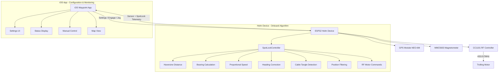

# AutoHelm - GPS Navigation System

AutoHelm is a GPS-guided autonomous position-hold system for electric trolling motors. The Helm device (ESP32-S3) runs the full Spot Lock algorithm onboard — reading sensors, computing corrections, and transmitting RF motor commands without requiring a phone connection. The Waypoint iOS app provides configuration, monitoring, and manual control.

## System Architecture


```mermaid
graph TB
    A[iOS Waypoint App] -->|Settings / Engage / Jog| B[ESP32 Helm Device]
    B -->|Sensor + SpotLock Telemetry| A

    B --> C[GPS Module NEO-6M]
    B --> D[MMC5603 Magnetometer]
    B --> F[CC1101 RF Controller]
    F -->|433.017MHz| H[Trolling Motor]

    subgraph "Helm Device - Onboard Algorithm"
        B --> SL[SpotLockController]
        SL --> SL1[Haversine Distance]
        SL --> SL2[Bearing Calculation]
        SL --> SL3[Proportional Speed]
        SL --> SL4[Heading Correction]
        SL --> SL5[Cable Tangle Detection]
        SL --> SL6[Position Filtering]
        SL --> RF[RF Motor Commands]
    end

    subgraph "iOS App - Configuration & Monitoring"
        A --> UI1[Settings UI]
        A --> UI2[Status Display]
        A --> UI3[Manual Control]
        A --> UI4[Map View]
    end
```

### Component Responsibilities

**Helm Device (ESP32-S3):**
- **Sensors:** Reads GPS position, compass heading, satellite count, DOP values
- **SpotLock Algorithm:** Runs the full position-hold control loop onboard
- **RF Control:** Transmits motor commands directly via 433MHz CC1101
- **BLE Peripheral:** Broadcasts sensor + SpotLock telemetry every 500ms; receives configuration and high-level commands from the app
- **Autonomous Operation:** Continues holding position if the phone disconnects

**Waypoint App (iOS):**
- **Configuration:** Edits and uploads SpotLock settings to the device
- **Monitoring:** Displays live distance, bearing, speed level, GPS quality
- **High-Level Commands:** Engage/disengage, jog lock position, upload calibration
- **Manual Control:** Sends RF commands directly for manual motor operation
- **Map View:** Shows Helm location and active lock pin with real-time updates

### Data Flow

```
Sensors → [ESP32] → SpotLockController → RF motor commands → Motor
                  ↕ BLE (500ms telemetry)
              [iOS App] → Engage / Settings / Jog
```

The control loop runs entirely on the ESP32. The phone is not in the critical path.

## Key Features

- **Device-Side Autonomous Navigation:** Full Spot Lock algorithm runs on the ESP32, no phone required once engaged
- **Autonomous BLE-Disconnect Survival:** Motor holds position if phone disconnects mid-session
- **Proportional Position Hold:** Thrust and steering scale with distance error, dead-zone hysteresis prevents hunting
- **Non-Blocking Control Loop:** Steering holds and speed steps run as state machines — main loop never blocks
- **Cable Tangle Prevention:** Tracks cumulative rotation; automatically reverses to untangle
- **Configurable Settings:** 20+ parameters uploaded from the iOS app and stored on device
- **Manual Override:** Manual motor buttons immediately disengage Spot Lock
- **Compass Calibration:** Hard-iron/soft-iron calibration with heading offset, persisted on device

## Technology Stack

**ESP32 Hardware:**
- ESP32-S3 Mini (or compatible ESP32 with SPI, UART2, I2C)
- U-blox NEO-6M GPS Module
- PiicoDev Magnetometer MMC5603 (I2C)
- CC1101 433MHz RF Transceiver Module

**iOS App:**
- Swift 5.0 / SwiftUI
- MapKit, Core Location, Core Bluetooth
- Combine for reactive state sync from BLE telemetry
- iOS 17.0+ deployment target

## Hardware Setup

**Pin Configuration:**

| Function | GPIO | Notes |
|----------|------|-------|
| CC1101 CS | 5 | SPI Chip Select |
| CC1101 GDO0 | 4 | TX Data (RMT output) |
| CC1101 SCK | 18 | SPI Clock |
| CC1101 MISO | 19 | SPI Data In |
| CC1101 MOSI | 23 | SPI Data Out |
| GPS RX | 16 | UART2 RX (from GPS TX) |
| GPS TX | 17 | UART2 TX (to GPS RX) — optional |
| I2C SDA | 21 | Magnetometer |
| I2C SCL | 22 | Magnetometer |

**Power:**
- CC1101: 3.3V only
- GPS Module: 3.3V (NEO-6M)
- Magnetometer: 3.3V
- ESP32: USB or regulated supply

**CRITICAL:** Do NOT connect 5V to 3.3V-only modules.

## Installation

### Firmware

1. **Clone repository:**
   ```bash
   git clone https://github.com/brentonford/AutoHelm.git
   cd AutoHelm/Helm
   ```

2. **Install required library:**
   - Arduino IDE → Library Manager → install **Adafruit MMC56x3**

3. **Upload:**
   - Board: ESP32-S3 Dev Module (or ESP32 Dev Module)
   - Upload `Helm.ino`

### iOS App

1. ```bash
   cd AutoHelm/Waypoint
   open Waypoint.xcodeproj
   ```

2. Set your Development Team in Signing & Capabilities

3. Build and run (Cmd+R)

## Bluetooth Communication

**Service UUID:** `0000FFE0-0000-1000-8000-00805F9B34FB`
**Device Name:** `Helm`

### Characteristics

| UUID | Properties | Purpose |
|------|------------|---------|
| FFE2 | Notify | Sensor + SpotLock telemetry (JSON, 500ms) |
| FFE3 | Write | Commands from app |
| FFE4 | Notify | Compass calibration data stream |
| FFE5 | Notify | Command acknowledgements (JSON) |

### Commands (FFE3 → Device)

**SpotLock Commands:**
```
SPOTLOCK_ENGAGE:<lat>,<lon>         Engage at position (e.g. SPOTLOCK_ENGAGE:-33.001234,151.001234)
SPOTLOCK_DISENGAGE                  Disengage and ramp motor to zero
SPOTLOCK_JOG:FORWARD|BACK|LEFT|RIGHT  Move lock position by jogDistance
SPOTLOCK_SETTINGS:<csv>             Upload 20-field settings (see below)
```

**Manual RF Commands** (blocked while SpotLock active):
```
RF_LEFT_HOLD    Start continuous left steering
RF_RIGHT_HOLD   Start continuous right steering
RF_UP           Speed increase (1 second pulse)
RF_DOWN         Speed decrease (1 second pulse)
RF_MOTOR        Motor toggle
RF_MOMENTARY    Momentary function
RF_RELEASE      Stop hold transmission
```

**Calibration Commands:**
```
START_CAL                             Begin compass calibration
STOP_CAL                              Stop and return calibration values
CAL_VALUES:<ox,oy,oz,sx,sy,sz,ho>    Apply calibration to device
```

### Settings Command Format

`SPOTLOCK_SETTINGS:` followed by 20 comma-separated values in this order:

| # | Field | Default | Unit |
|---|-------|---------|------|
| 1 | deadZoneRadius | 2.0 | m |
| 2 | activationThreshold | 4.0 | m |
| 3 | jogDistance | 1.5 | m |
| 4 | minSpeed | 3 | level |
| 5 | maxSpeed | 10 | level |
| 6 | proportionalGain | 1.0 | — |
| 7 | speedChangeDelay | 2.0 | seconds |
| 8 | headingTolerance | 10.0 | degrees |
| 9 | correctionInterval | 1.0 | seconds |
| 10 | smallAngleThreshold | 30.0 | degrees |
| 11 | largeAngleThreshold | 90.0 | degrees |
| 12 | smallSteeringDuration | 200 | ms |
| 13 | mediumSteeringDuration | 600 | ms |
| 14 | largeSteeringDuration | 1000 | ms |
| 15 | maxRotationBeforeUntangle | 720.0 | degrees |
| 16 | rotationPerMs | 0.1 | deg/ms |
| 17 | minSatellites | 4 | count |
| 18 | maxHDOP | 5.0 | — |
| 19 | maxConsecutiveGpsFailures | 5 | count |
| 20 | filterWindowSize | 5 | samples |

Settings are automatically uploaded to the device on every BLE connect.

### Sensor Status Format (FFE2)

When SpotLock is **inactive:**
```json
{
    "has_fix": true,
    "satellites": 8,
    "currentLat": -32.940931,
    "currentLon": 151.718029,
    "altitude": 45.2,
    "hdop": 1.2,
    "heading": 127.5,
    "sl_active": false
}
```

When SpotLock is **active** (additional fields):
```json
{
    "has_fix": true,
    "satellites": 8,
    "currentLat": -32.940931,
    "currentLon": 151.718029,
    "altitude": 45.2,
    "hdop": 1.2,
    "heading": 127.5,
    "sl_active": true,
    "sl_lat": -32.940950,
    "sl_lon": 151.718010,
    "sl_dist": 2.31,
    "sl_bearing": 217.4,
    "sl_speed": 4,
    "sl_rotation": 180.0,
    "sl_tangled": false,
    "sl_thrust": true
}
```

## SpotLock Algorithm

The algorithm runs as a non-blocking state machine inside the ESP32 main loop. Each `loop()` iteration:

1. **Steering hold processing** — retransmits the held button every 68ms; releases when duration elapses
2. **Speed step processing** — transmits UP/DOWN for 1s per step, respects `speedChangeDelayMs` between steps
3. **Correction logic** — runs every `correctionIntervalMs`:
   - GPS quality check (fix, satellite count, HDOP)
   - Filtered GPS position (rolling average of last N samples)
   - Haversine distance + bearing to lock position
   - Relative heading angle → steering direction + duration
   - Cable tangle check → forced untangle if cumulative rotation exceeds limit
   - Proportional thrust: `speed = (distance − deadZone) × gain + minSpeed`

**Control loops:**

| Loop | Rate | Driven by |
|------|------|-----------|
| Hold retransmit | 68ms | `millis()` in main loop |
| Correction | 1s (configurable) | `correctionIntervalMs` |
| GPS update | 2Hz | NEO-6M UART |
| BLE telemetry | 2Hz | `statusBroadcastIntervalMs` |

## Usage

### First-Time Setup

1. Power on the ESP32 — GPS begins acquiring fix (30–60s outdoors)
2. Open Waypoint app — connects automatically to "Helm"
3. Go to **Settings → Compass Calibration** — rotate device through all axes, tap Stop
4. Calibration is saved and auto-uploaded on every connect

### Engaging Spot Lock

1. Ensure GPS quality is Good or Excellent (status toolbar)
2. Confirm motor is **ON** and **speed is at 0**
3. Tap **"Engage at Current Position"** (Helm tab or Map overlay)
4. The app uploads current settings and sends `SPOTLOCK_ENGAGE:lat,lon` to the device
5. The device zeros the motor, then begins the position-hold loop autonomously

### Jog Controls

While Spot Lock is active, hold any jog arrow to move the lock point:
- **N / Forward:** 0° (north)
- **E / Right:** 90° (east)
- **S / Back:** 180° (south)
- **W / Left:** 270° (west)

Each 200ms interval sends a `SPOTLOCK_JOG:direction` command; the device moves the lock point by `jogDistance` (default 1.5m) per command.

### Manual Control

Manual buttons (left/right hold, speed+/speed−, motor) always work. Pressing any manual control button sends `SPOTLOCK_DISENGAGE` first, then the RF command.

### Phone Disconnected

If BLE drops while Spot Lock is engaged, the device **continues holding position autonomously**. Reconnecting the app resumes monitoring with no intervention required. The device only performs an emergency motor ramp-down on disconnect when Spot Lock is not active.

## Safety Features

| Feature | Behaviour |
|---------|-----------|
| GPS fix lost | Auto-disengage after `maxConsecutiveGpsFailures` cycles |
| Poor HDOP | Counted as GPS failure; disengages if sustained |
| BLE disconnect (SpotLock active) | Algorithm continues uninterrupted |
| BLE disconnect (SpotLock inactive) | 10× RF_DOWN emergency stop sequence |
| Manual button press | Disengages SpotLock before executing command |
| 30s hold timeout | Device auto-releases any stuck RF hold |
| Cable tangle (`>720°`) | Forces reverse steering until rotation `<360°` |

## RF Protocol

| Parameter | Value |
|-----------|-------|
| Frequency | 433.017 MHz |
| Modulation | 2-FSK |
| Encoding | Manchester (IEEE 802.3) |
| Bit period | 104 µs |
| Hold retransmit interval | 68ms |
| Packet length | 137 bits |

**Packet structure:**
```
Preamble   Sync Word  Device ID   Command
32 bits    32 bits    48 bits     25 bits
2aaaaaaa   d391d391   [unique]    [varies]
```

Device ID is unique per remote. Capture yours with an RTL-SDR.

## Project Structure

```
AutoHelm/
├── Helm/                          # ESP32 firmware
│   ├── Helm.ino                   # Main loop
│   ├── SpotLockController.h/.cpp  # Onboard position-hold algorithm  ← NEW
│   ├── BleManager.h/.cpp          # BLE peripheral + command parser
│   ├── GpsManager.h/.cpp          # NEO-6M NMEA parsing
│   ├── CompassManager.h/.cpp      # MMC5603 magnetometer + calibration
│   ├── Remote.h/.cpp              # 433MHz RF Manchester encoding
│   ├── CC1101.h/.cpp              # SPI RF transceiver driver
│   └── DataModels.h               # Shared structs (GpsData, SpotLockSettings, …)
│
└── Waypoint/                      # iOS companion app
    └── Waypoint/
        ├── Controllers/
        │   └── SpotLockController.swift   # Thin proxy — forwards commands, syncs state
        ├── Models/
        │   ├── SensorData.swift           # Decodes sl_* telemetry fields
        │   ├── SpotLockSettings.swift     # Settings + toSettingsCommand() CSV encoder
        │   └── Models.swift               # Coordinate math, enums
        ├── Managers/
        │   ├── BluetoothManager.swift     # BLE central, engage/disengage/settings upload
        │   └── DataStore.swift            # UserDefaults persistence
        └── Views/
            ├── ContentView.swift          # Tab root (no algorithm timer)
            ├── MapView.swift              # Map + SpotLock pin + jog overlay
            ├── HelmControlView.swift      # Manual controls + SpotLock status
            ├── SpotLockSettingsView.swift  # 20+ configurable parameters
            └── SettingsView.swift         # Calibration + device management
```

## Troubleshooting

**GPS not acquiring fix:**
- Allow 30–60s outdoors with clear sky view
- Check wiring: GPS TX → ESP32 pin 16 (UART2 RX)
- Serial monitor: look for `[GPS] *** FIRST FIX ACQUIRED ***`

**SpotLock won't engage:**
- GPS quality must be Fair or better (≥4 satellites, HDOP <5)
- Motor must be ON and at speed 0 before engaging
- Check serial output for `[SpotLock] ENGAGE at …`

**Motor not responding to SpotLock:**
- Verify CC1101 SPI wiring
- Use RTL-SDR to confirm 433.017 MHz signal on engage
- Check `secrets.h` device ID matches your remote

**BLE connection fails:**
- Verify iOS Bluetooth permissions
- Use nRF Connect to confirm "Helm" is advertising
- Power cycle ESP32; forget device on iPhone and reconnect

**Settings not taking effect:**
- Settings are uploaded automatically on connect; reconnect if needed
- Check serial output for `[SpotLock] Settings applied`

## Reporting Issues

**GitHub Issues:** https://github.com/brentonford/AutoHelm/issues

## Version History

**v3.0** (Current — March 2026)
- **Architecture Change:** SpotLock algorithm moved from iOS app to ESP32 device
- Device now runs full position-hold loop autonomously (no phone required once engaged)
- Non-blocking steering and speed state machines — main loop never stalls
- BLE disconnect while engaged no longer stops the motor
- New BLE commands: `SPOTLOCK_ENGAGE`, `SPOTLOCK_DISENGAGE`, `SPOTLOCK_JOG`, `SPOTLOCK_SETTINGS`
- Extended sensor status JSON with `sl_*` telemetry fields
- Settings auto-uploaded to device on every BLE connect
- iOS SpotLockController simplified to a thin Combine-driven view-model proxy
- Removed app-side algorithm timer and disconnect grace timer

**v2.0** (December 2024)
- Architecture Change: All autonomous navigation moved to iOS app
- Helm device became sensor-only (GPS/compass broadcast via BLE)
- Spot Lock, proportional speed, cable tangle detection implemented in Swift
- Configurable settings with validation
- Compass hard-iron/soft-iron calibration with heading offset

**v1.1** (November 2024)
- Fixed GPS coordinate parsing
- Added iOS waypoint list with search, sort, filter
- Automatic geographic waypoint naming
- Real-time status indicators
- Enhanced safety features

**v1.0** (November 2024)
- Basic GPS navigation with waypoint guidance
- RF motor control via CC1101 433MHz transceiver
- BLE communication between iOS and ESP32
- Compass calibration system

## License

MIT License. See LICENSE file for details.

## Credits

- **PiicoDev** for I2C modules and documentation
- **Texas Instruments** for CC1101 documentation
- **Espressif** for ESP32 platform and libraries
- **U-blox** for GPS module documentation

---

**AutoHelm** - Device-Side Autonomous GPS Position Hold for Electric Boats
