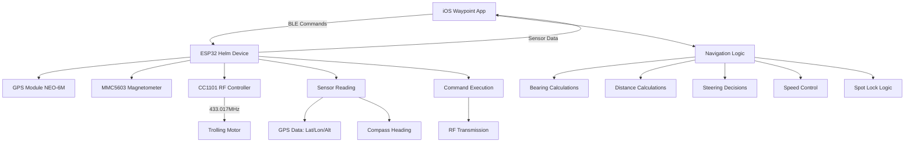

# AutoHelm - GPS Navigation System

AutoHelm is a comprehensive navigation system for autonomous GPS-guided boat control. The Waypoint iOS app handles all autonomous navigation calculations and decision-making, while the Helm device (ESP32) provides sensor data and executes motor commands via 433MHz RF.

## System Architecture


```mermaid
graph TB
    A[iOS Waypoint App] -->|BLE Commands| B[ESP32 Helm Device]
    B -->|Sensor Data| A
    B --> C[GPS Module NEO-6M]
    B --> D[MMC5603 Magnetometer]
    B --> F[CC1101 RF Controller]
    F -->|433.017MHz| H[Trolling Motor]
    
    A --> I[Navigation Logic]
    I --> J[Bearing Calculations]
    I --> K[Distance Calculations]
    I --> L[Steering Decisions]
    I --> M[Speed Control]
    I --> N[Spot Lock Logic]
    
    B --> O[Sensor Reading]
    O --> P[GPS Data: Lat/Lon/Alt]
    O --> Q[Compass Heading]
    
    B --> R[Command Execution]
    R --> S[RF Transmission]
```

### Component Responsibilities

**Helm Device (ESP32):**
- **Sensors:** Reads GPS position, compass heading, satellite count, DOP values
- **Communication:** Broadcasts sensor data via BLE every 500ms
- **Execution:** Transmits RF motor commands when received from app
- **No Intelligence:** Does NOT make any navigation decisions

**Waypoint App (iOS):**
- **All Navigation Logic:** Calculates bearings, distances, relative angles
- **Decision Making:** Determines when to send steering/speed commands
- **Timing Control:** Manages 2-second command intervals, gradual acceleration
- **Spot Lock:** Maintains position logic, jog control
- **Safety:** Monitors GPS quality, handles disconnects

### Data Flow

```
1. Helm Device reads GPS/Compass → Sensor data
2. Helm Device → BLE → Sensor data → Waypoint App
3. Waypoint App calculates navigation → Decisions
4. Waypoint App → BLE → RF Commands → Helm Device
5. Helm Device → RF → Motor executes command
```

## Key Features

- **Client-Side Autonomous Navigation**: All navigation logic runs in iOS app
- **Sensor-Only Helm Device**: ESP32 provides real-time GPS and compass data
- **Wireless Motor Control**: 433MHz RF commands with hold and momentary modes
- **Spot Lock**: Maintains position within 2m radius with automatic corrections
- **Offline Map Support**: Download and store OpenStreetMap tiles
- **Waypoint Management**: Create, edit, and manage waypoints with geographic naming
- **Real-time Status**: Live indicators for Connection, GPS, Compass, and Navigation

## Technology Stack

**ESP32 Hardware:**
- ESP32 DevKit (WROOM-32 or similar)
- U-blox NEO-6M Compatible GPS Module
- PiicoDev Magnetometer MMC5603 (I2C)
- CC1101 433MHz RF Transceiver Module

**iOS App:**
- Swift 5.0
- SwiftUI framework
- MapKit for mapping functionality
- Core Location for GPS services
- Core Bluetooth for BLE communication
- iOS 17.0+ deployment target

## Hardware Setup

**Pin Configuration:**

| Function | GPIO | Notes |
|----------|------|-------|
| CC1101 CS | 5 | SPI Chip Select |
| CC1101 GDO0 | 4 | TX Data (RMT output) |
| CC1101 SCK | 18 | SPI Clock |
| CC1101 MISO | 19 | SPI Data In |
| CC1101 MOSI | 23 | SPI Data Out |
| GPS RX | 16 | UART2 RX (from GPS TX) |
| GPS TX | 17 | UART2 TX (to GPS RX) - Optional |
| I2C SDA | 21 | Magnetometer |
| I2C SCL | 22 | Magnetometer |

**Power Connections:**
- CC1101: 3.3V only (not 5V tolerant)
- GPS Module: 3.3V or 5V (check module specs - NEO-6M is typically 3.3V)
- Magnetometer: 3.3V
- ESP32: USB or regulated 3.3V supply

**CRITICAL:** Do NOT connect 5V to 3.3V-only modules!

## Installation

### Firmware Installation

1. **Clone Repository:**
   ```bash
   git clone https://github.com/brentonford/AutoHelm.git
   cd AutoHelm/Helm
   ```

2. **Install Required Libraries:**
   - Open Arduino IDE Library Manager
   - Install: Adafruit MMC56x3

3. **Upload Firmware:**
   - Select Board: ESP32 Dev Module
   - Select appropriate COM port
   - Upload sketch

### iOS App Installation

1. **Development Setup:**
   ```bash
   cd AutoHelm/Waypoint
   open Waypoint.xcodeproj
   ```

2. **Configure Development Team:**
   - Open project settings
   - Set Development Team in Signing & Capabilities
   - Update Bundle Identifier if needed

3. **Build and Run:**
   - Select target device
   - Build and run (Cmd+R)

## Bluetooth Communication

### Overview

- ESP32 acts as BLE **Peripheral** (advertises and provides sensor data)
- iPhone acts as **Central** (makes all navigation decisions)

### BLE Service Definition

**Service UUID:** `0000FFE0-0000-1000-8000-00805F9B34FB`
**Device Name:** "Helm"

### Characteristics

| UUID | Properties | Purpose | Format |
|------|------------|---------|--------|
| FFE2 | Notify | Sensor status | JSON |
| FFE3 | Write | Commands | String |
| FFE4 | Notify | Calibration/responses | JSON |

### Commands (FFE3)

**Calibration Commands:**
```
START_CAL      - Begin compass calibration
STOP_CAL       - End calibration
```

**RF Motor Control Commands (app sends these):**
```
RF_LEFT_HOLD   - Start continuous left transmission (hold button)
RF_RIGHT_HOLD  - Start continuous right transmission (hold button)
RF_UP          - Speed increase (1 second pulse)
RF_DOWN        - Speed decrease (1 second pulse)
RF_MOTOR       - Motor toggle (1 second pulse)
RF_MOMENTARY   - Momentary function (1 second pulse)
RF_RELEASE     - Stop hold transmission
```

### Sensor Status Format (FFE2)

```json
{
    "has_fix": true,
    "satellites": 8,
    "currentLat": -32.940931,
    "currentLon": 151.718029,
    "altitude": 45.2,
    "hdop": 1.2,
    "heading": 127.5
}
```

## Usage

### Basic Operation

1. **Power On System:**
   - ESP32 boots and initializes GPS/Compass sensors
   - GPS begins acquiring fix (30-60 seconds outdoors)
   - Watch for "[GPS] *** FIRST FIX ACQUIRED ***" message

2. **Connect iOS App:**
   - Open Waypoint app
   - Bluetooth scans for "Helm"
   - Tap to connect
   - Status indicators show green when ready

3. **Set Waypoint:**
   - Long-press map location in iOS app
   - Edit name if desired
   - Tap "Add" to save
   - Select waypoint from map or list

4. **Navigate to Waypoint:**
   - Tap "Navigate to Waypoint"
   - **App autonomously:**
     - Waits 2 seconds before motor start
     - Sends MOTOR command to start
     - Sends SPEED UP commands every 1.5s until reaching target speed
     - Sends LEFT/RIGHT corrections every 2s when off-course >15°
     - Monitors distance and shows arrival within 5m

### Autonomous Navigation Details

**How It Works:**
1. App receives sensor data from Helm every 500ms
2. App calculates: bearing to target, distance, relative angle
3. App decides: which commands to send based on calculations
4. App sends: RF commands to Helm device via BLE
5. Helm device: Executes RF transmission to motor

**Speed Control Timeline:**
```
Time   | Speed Level | Action
0.0s   | 0 → 0       | Navigation enabled, 2s initial delay
2.0s   | Motor ON    | App sends MOTOR command
4.0s   | 0 → 1       | First SPEED UP command
5.5s   | 1 → 2       | SPEED UP (1.5s interval)
7.0s   | 2 → 3       | SPEED UP
8.5s   | 3 → 4       | SPEED UP, target reached
```

**Steering Control:**
- Every 2 seconds, app checks relative angle
- If >15° off course: sends LEFT or RIGHT command
- If within ±15°: no command sent ("On Course")

### Spot Lock

1. **Engage Spot Lock:**
   - Tap "Engage Spot Lock" button
   - App captures current GPS position as lock point
   - **App autonomously:**
     - Calculates distance from lock position
     - Sends MOMENTARY_HOLD when >2m from lock
     - Sends RELEASE when <2m from lock
     - Sends LEFT/RIGHT corrections when off-course >15°

2. **Jog Controls:**
   - Move lock position 1.5m in selected direction
   - Forward: current heading
   - Back: current heading + 180°
   - Left: current heading - 90°
   - Right: current heading + 90°

### Manual Control

**Always Available:**
- Hold buttons (LEFT/RIGHT): Press and hold for continuous steering
- Momentary buttons (UP/DOWN/MOTOR/M): Tap for 1-second pulse
- **Automatically disables autonomous navigation when used**

### Safety Features

**Automatic Stops:**
- BLE disconnect: Stops any hold transmissions immediately
- GPS fix loss: App stops sending navigation commands
- Poor GPS quality: App disables autonomous mode
- Manual button press: Immediately exits autonomous mode
- 30-second hold timeout: Safety release if hold gets stuck

## RF Protocol

### Signal Parameters

| Parameter | Value |
|-----------|-------|
| Frequency | 433.017 MHz |
| Modulation | 2-FSK |
| Encoding | Manchester Code (IEEE 802.3) |
| Deviation | ~25 kHz (TX), ~5 kHz (RX) |
| Bit period | 104 µs |
| Packet length | 137 bits |

### Packet Structure

```
| Preamble | Sync Word | Device ID    | Command   |
| 32 bits  | 32 bits   | 48 bits      | 25 bits   |
| 2aaaaaaa | d391d391  | xxxxxxxxxxxx | varies    |
```

**Note:** Device ID is unique per remote. Capture your specific remote's ID using RTL-SDR.

### Button Codes

| Button | Command | Payload Structure |
|--------|---------|-------------------|
| Right | `08696a8` | `2aaaaaaad391d391[DeviceID]08696a8` |
| Left | `0269568` | `2aaaaaaad391d391[DeviceID]0269568` |
| Up | `0469428` | `2aaaaaaad391d391[DeviceID]0469428` |
| Down | `806a5a8` | `2aaaaaaad391d391[DeviceID]806a5a8` |
| Motor | `4068da8` | `2aaaaaaad391d391[DeviceID]4068da8` |
| Momentary | `10693a8` | `2aaaaaaad391d391[DeviceID]10693a8` |
| Release | `00e9590` | `2aaaaaaad391d391[DeviceID]00e9590` |

## Troubleshooting

### GPS Not Acquiring Fix

**Symptoms:**
- "Satellites: 0" in status output
- No position displayed

**Common Issues:**

1. **No NMEA Data Received:**
   ```
   Symptom: [GPS] WARNING: No data received from GPS module!
   Check: GPS TX must connect to ESP32 Pin 16 (UART2 RX)
   Fix: Verify wiring, check GPS power (3.3V typically for NEO-6M)
   ```

2. **Data Received but No Fix:**
   ```
   Symptom: Character count > 0 but satellites = 0
   Check: GPS needs clear sky view, allow 30-60 seconds
   Fix: Move outdoors, wait for satellite acquisition
   ```

### BLE Connection Fails

```
Check: iOS Bluetooth permissions enabled
Debug: Use nRF Connect app to verify advertising
Fix: Power cycle ESP32, forget device on iPhone and re-pair
Note: Device advertises as "Helm"
```

### Navigation Not Working

```
Check: Status indicators in iOS app
Common Issues:
  - GPS indicator red/orange: Wait for valid fix
  - Connection indicator red: BLE not connected
  - "Satellites: 0": GPS not ready
  - "No waypoint selected": Select waypoint first
Fix: Ensure all indicators are green before navigation
```

### RF Commands Not Working

```
Check: CC1101 enters TX mode
Debug: Use RTL-SDR to verify 433.017 MHz signal
Fix: Verify Manchester timing, check antenna connection
Note: Device ID must match your remote (capture with RTL-SDR)
```

## Project Structure

```
autohelm/
├── Helm/                      # ESP32 firmware (Sensors Only)
│   ├── Helm.ino              # Main sensor loop
│   ├── CC1101.h/.cpp         # RF transceiver driver
│   ├── Remote.h/.cpp         # RF remote control protocol
│   ├── GPSManager.h/.cpp     # GPS module interface with NMEA parsing
│   ├── CompassManager.h/.cpp # Magnetometer interface
│   ├── BleManager.h/.cpp     # ESP32 BLE (sensor broadcasting)
│   └── DataModels.h          # Shared data structures
│
└── Waypoint/                 # iOS companion app (Autonomous Control)
    ├── Waypoint/
    │   ├── Models/
    │   │   └── Models.swift          # Data models
    │   ├── Managers/
    │   │   ├── BluetoothManager.swift # BLE client (autonomous control)
    │   │   └── LocationManager.swift  # iOS location services
    │   ├── Views/
    │   │   ├── ContentView.swift      # Main tab view
    │   │   ├── MapView.swift          # Map interface
    │   │   ├── WaypointListView.swift # Waypoint management
    │   │   ├── HelmControlView.swift  # Autonomous navigation logic
    │   │   └── SettingsView.swift     # Settings and calibration
    │   ├── Components/
    │   └── WaypointApp.swift  # App entry point
    └── Waypoint.xcodeproj
```

## Reporting Issues

Found a bug or have a feature request?

**Report on GitHub:** https://github.com/brentonford/AutoHelm/issues

## Version History

**v2.0** (Current - December 2024)
- **Architecture Change:** All autonomous navigation moved to iOS app
- Helm device now sensor-only: provides GPS/compass data via BLE
- iOS app handles all navigation calculations and timing
- Improved autonomous navigation with proper state management
- Enhanced spot lock with client-side logic
- Simplified Helm firmware: removed NavigationManager
- Updated BLE protocol: sensor data broadcast every 500ms
- Better error handling and safety features
- Cleaner separation of concerns

**v1.1** (November 2024)
- Fixed GPS coordinate parsing (static buffer reuse issue)
- Added iOS waypoint list with search, sort, and filter
- Implemented automatic geographic waypoint naming
- Added Settings tab with preferences
- Fixed map waypoint selection
- Added real-time status indicators
- Improved motor control feedback
- Enhanced safety features

**v1.0** (Initial Release - November 2024)
- Basic GPS navigation with waypoint guidance
- RF motor control via CC1101 433MHz transceiver
- BLE communication between iOS and ESP32
- iOS companion app with map and helm control
- Compass calibration system
- Manual motor control buttons
- Basic waypoint management

## License

This project is licensed under the MIT License. See LICENSE file for details.

## Credits

- **PiicoDev** for I2C modules and excellent documentation
- **Texas Instruments** for CC1101 documentation
- **Espressif** for ESP32 platform and libraries
- **OpenStreetMap contributors** for mapping data
- **U-blox** for GPS module documentation

---

**AutoHelm** - Client-Side Autonomous GPS Navigation for Electric Boats